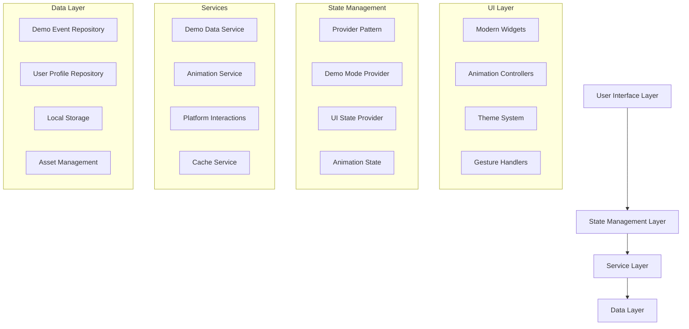
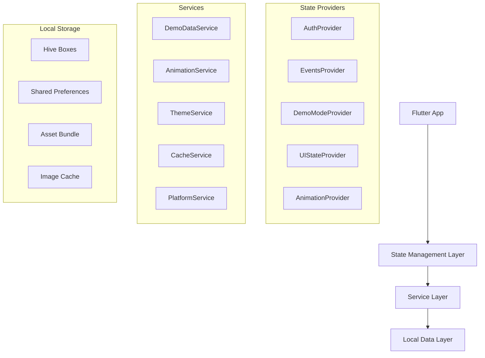
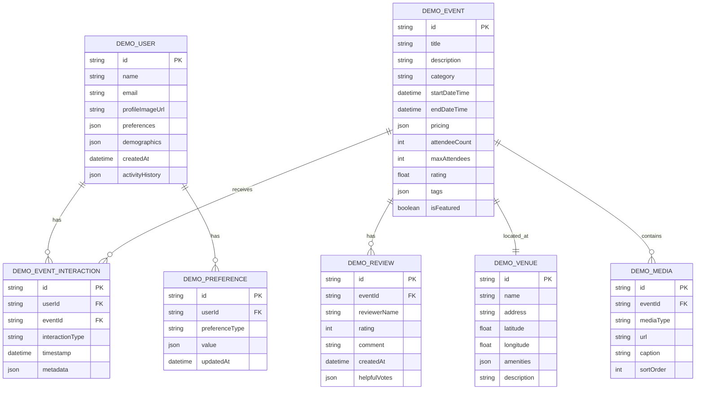

# Technical Architecture for UI and Demo Mode Enhancements
## SomethingToDo Flutter App

## 1. Architecture Design



## 2. Technology Description

- **Frontend**: Flutter 3.16+ with Dart 3.2+
- **State Management**: Provider pattern for reactive state management
- **Animations**: flutter_animate, flutter_staggered_animations
- **UI Components**: glassmorphism, cached_network_image, liquid_pull_to_refresh
- **Local Storage**: Hive for demo data persistence
- **Platform Integration**: platform_interactions for native feel
- **Typography**: google_fonts (Inter family)
- **Image Handling**: cached_network_image with custom placeholders

## 3. Route Definitions

| Route | Purpose |
|-------|----------|
| /splash | Enhanced splash screen with demo mode detection |
| /auth | Authentication screen with improved demo mode entry |
| /home | Modern home screen with enhanced event discovery |
| /events | Event listing with advanced filtering and animations |
| /event-details | Detailed event view with rich interactions |
| /profile | User profile with demo mode indicators |
| /search | Enhanced search with real-time suggestions |
| /map | Interactive map with smooth animations |
| /settings | Settings screen with theme customization |
| /demo-tutorial | Interactive demo mode tutorial |

## 4. API Definitions

### 4.1 Demo Data Service API

**Enhanced Event Generation**
```dart
class DemoDataService {
  Future<List<Event>> generateDemoEvents({
    int count = 50,
    List<EventCategory> categories,
    DateRange dateRange,
    LocationBounds locationBounds,
  });
  
  Future<UserProfile> generateDemoUser({
    String? preferredName,
    List<String> interests,
    Location? location,
  });
  
  Future<List<EventReview>> generateEventReviews({
    required String eventId,
    int count = 10,
  });
}
```

**Demo Interaction Simulation**
```dart
class DemoInteractionService {
  Future<void> simulateUserBehavior({
    required UserProfile user,
    required List<Event> events,
  });
  
  Future<List<Event>> getPersonalizedRecommendations({
    required UserProfile user,
    int count = 10,
  });
  
  Future<void> simulateNotification({
    required NotificationType type,
    required Map<String, dynamic> data,
  });
}
```

### 4.2 Enhanced UI Service API

**Animation Management**
```dart
class AnimationService {
  AnimationController createStaggeredController({
    required int itemCount,
    required Duration duration,
  });
  
  Future<void> animateListEntry({
    required List<Widget> items,
    Duration delay = const Duration(milliseconds: 100),
  });
  
  Future<void> animatePageTransition({
    required Widget fromPage,
    required Widget toPage,
    TransitionType type = TransitionType.slide,
  });
}
```

**Theme Management**
```dart
class ThemeService {
  ThemeData generateDynamicTheme({
    required Color primaryColor,
    Brightness brightness = Brightness.dark,
  });
  
  List<Color> extractColorsFromImage(ImageProvider image);
  
  ThemeData getEventCategoryTheme(EventCategory category);
}
```

### 4.3 Platform Integration API

**Enhanced Platform Interactions**
```dart
class PlatformInteractions {
  static Future<void> showEnhancedToast({
    required BuildContext context,
    required String message,
    IconData? icon,
    Color? backgroundColor,
    Duration duration = const Duration(seconds: 3),
  });
  
  static Future<void> triggerHapticPattern({
    required HapticPattern pattern,
  });
  
  static Future<void> showInteractiveBottomSheet({
    required BuildContext context,
    required Widget child,
    bool isDismissible = true,
    double initialChildSize = 0.5,
  });
}
```

## 5. Server Architecture Diagram



## 6. Data Model

### 6.1 Enhanced Data Model Definition



### 6.2 Data Definition Language

**Demo User Storage**
```dart
// Hive box for demo user data
@HiveType(typeId: 1)
class DemoUser extends HiveObject {
  @HiveField(0)
  String id;
  
  @HiveField(1)
  String name;
  
  @HiveField(2)
  String email;
  
  @HiveField(3)
  String profileImageUrl;
  
  @HiveField(4)
  Map<String, dynamic> preferences;
  
  @HiveField(5)
  List<String> favoriteEventIds;
  
  @HiveField(6)
  List<DemoEventInteraction> interactions;
  
  @HiveField(7)
  DateTime createdAt;
  
  @HiveField(8)
  DateTime lastActiveAt;
}
```

**Enhanced Demo Event Storage**
```dart
@HiveType(typeId: 2)
class DemoEvent extends HiveObject {
  @HiveField(0)
  String id;
  
  @HiveField(1)
  String title;
  
  @HiveField(2)
  String description;
  
  @HiveField(3)
  EventCategory category;
  
  @HiveField(4)
  DateTime startDateTime;
  
  @HiveField(5)
  DateTime endDateTime;
  
  @HiveField(6)
  DemoVenue venue;
  
  @HiveField(7)
  List<String> imageUrls;
  
  @HiveField(8)
  EventPricing pricing;
  
  @HiveField(9)
  int attendeeCount;
  
  @HiveField(10)
  int maxAttendees;
  
  @HiveField(11)
  double rating;
  
  @HiveField(12)
  List<DemoReview> reviews;
  
  @HiveField(13)
  List<String> tags;
  
  @HiveField(14)
  bool isFeatured;
  
  @HiveField(15)
  String organizerName;
  
  @HiveField(16)
  String organizerImageUrl;
  
  @HiveField(17)
  Map<String, dynamic> socialMetrics;
}
```

**Demo Interaction Tracking**
```dart
@HiveType(typeId: 3)
class DemoEventInteraction extends HiveObject {
  @HiveField(0)
  String id;
  
  @HiveField(1)
  String userId;
  
  @HiveField(2)
  String eventId;
  
  @HiveField(3)
  InteractionType type; // view, like, share, bookmark, etc.
  
  @HiveField(4)
  DateTime timestamp;
  
  @HiveField(5)
  Map<String, dynamic> metadata;
  
  @HiveField(6)
  Duration duration; // time spent on event
}
```

**UI State Management**
```dart
@HiveType(typeId: 4)
class UIPreferences extends HiveObject {
  @HiveField(0)
  String userId;
  
  @HiveField(1)
  ThemeMode themeMode;
  
  @HiveField(2)
  Color accentColor;
  
  @HiveField(3)
  bool animationsEnabled;
  
  @HiveField(4)
  bool hapticsEnabled;
  
  @HiveField(5)
  double fontScale;
  
  @HiveField(6)
  bool highContrastMode;
  
  @HiveField(7)
  ViewType preferredViewType; // grid, list, card
  
  @HiveField(8)
  Map<String, dynamic> customizations;
}
```

**Demo Analytics Storage**
```dart
@HiveType(typeId: 5)
class DemoAnalytics extends HiveObject {
  @HiveField(0)
  String sessionId;
  
  @HiveField(1)
  DateTime sessionStart;
  
  @HiveField(2)
  DateTime sessionEnd;
  
  @HiveField(3)
  List<String> viewedScreens;
  
  @HiveField(4)
  List<DemoEventInteraction> interactions;
  
  @HiveField(5)
  Map<String, int> featureUsage;
  
  @HiveField(6)
  List<String> searchQueries;
  
  @HiveField(7)
  Map<String, dynamic> userJourney;
}
```

## 7. Implementation Architecture

### 7.1 Modular Structure
```
lib/
├── core/
│   ├── demo/
│   │   ├── demo_data_service.dart
│   │   ├── demo_interaction_service.dart
│   │   ├── demo_analytics_service.dart
│   │   └── demo_state_provider.dart
│   ├── ui/
│   │   ├── animation_service.dart
│   │   ├── theme_service.dart
│   │   ├── gesture_service.dart
│   │   └── ui_state_provider.dart
│   └── platform/
│       ├── platform_interactions.dart
│       ├── haptic_service.dart
│       └── native_bridge.dart
├── widgets/
│   ├── enhanced/
│   │   ├── animated_event_card.dart
│   │   ├── interactive_bottom_sheet.dart
│   │   ├── smart_loading_indicator.dart
│   │   └── gesture_detector_enhanced.dart
│   └── demo/
│       ├── demo_mode_banner.dart
│       ├── demo_tutorial_overlay.dart
│       └── demo_feature_highlight.dart
└── models/
    ├── demo/
    │   ├── demo_user.dart
    │   ├── demo_event.dart
    │   ├── demo_interaction.dart
    │   └── demo_analytics.dart
    └── ui/
        ├── animation_config.dart
        ├── theme_config.dart
        └── ui_preferences.dart
```

### 7.2 Performance Considerations
- **Lazy Loading**: Load demo data progressively
- **Memory Management**: Efficient disposal of animation controllers
- **Image Optimization**: Cached and compressed demo images
- **State Optimization**: Selective rebuilds with Provider selectors
- **Background Processing**: Generate demo data in isolates

### 7.3 Testing Strategy
- **Unit Tests**: Core services and data models
- **Widget Tests**: UI components and interactions
- **Integration Tests**: Complete user flows
- **Performance Tests**: Animation smoothness and memory usage
- **Accessibility Tests**: Screen reader and keyboard navigation

This architecture ensures scalable, maintainable, and performant implementation of the enhanced UI and demo mode features while maintaining clean separation of concerns and testability.