### 4.4 Firebase Security Rules

```javascript
// Firestore Security Rules
rules_version = '2';
service cloud.firestore {
  match /databases/{database}/documents {
    // Helper functions
    function isAuthenticated() {
      return request.auth != null;
    }
    
    function isOwner(userId) {
      return request.auth.uid == userId;
    }
    
    function isPremium() {
      return isAuthenticated() && 
        get(/databases/$(database)/documents/users/$(request.auth.uid)).data.isPremium == true;
    }
    
    function isValidEvent() {
      return request.resource.data.keys().hasAll(['title', 'startTime', 'venue']) &&
        request.resource.data.title is string &&
        request.resource.data.title.size() <= 500;
    }
    
    // Users collection
    match /users/{userId} {
      allow read: if isAuthenticated() && isOwner(userId);
      allow create: if isAuthenticated() && isOwner(userId);
      allow update: if isAuthenticated() && isOwner(userId) && 
        !request.resource.data.diff(resource.data).affectedKeys().hasAny(['isPremium', 'premiumExpiresAt']);
      allow delete: if false;
      
      // User favorites subcollection
      match /favorites/{eventId} {
        allow read: if isAuthenticated() && isOwner(userId);
        allow write: if isAuthenticated() && isOwner(userId);
      }
    }
    
    // Events collection (read-only for users)
    match /events/{eventId} {
      allow read: if true; // Public events
      allow write: if false; // Only Cloud Functions can write
    }
    
    // Chat sessions
    match /chatSessions/{sessionId} {
      allow read: if isAuthenticated() && 
        resource.data.userId == request.auth.uid;
      allow create: if isAuthenticated();
      allow update: if false; // Only Cloud Functions
      
      // Messages subcollection
      match /messages/{messageId} {
        allow read: if isAuthenticated() && 
          get(/databases/$(database)/documents/chatSessions/$(sessionId)).data.userId == request.auth.uid;
        allow create: if isAuthenticated() && 
          request.resource.data.role == 'user';
        allow update, delete: if false;
      }
    }
    
    // Analytics (write-only)
    match /analytics/{eventId} {
      allow read: if false;
      allow create: if isAuthenticated();
      allow update, delete: if false;
    }
    
    // Cache collection (Cloud Functions only)
    match /cache/{document=**} {
      allow read, write: if false;
    }
  }
}
```

### 4.5 Flutter Firebase Integration

```dart
// lib/services/firebase_service.dart
import 'package:firebase_core/firebase_core.dart';
import 'package:cloud_firestore/cloud_firestore.dart';
import 'package:firebase_auth/firebase_auth.dart';
import 'package:cloud_functions/cloud_functions.dart';
import 'package:firebase_messaging/firebase_messaging.dart';
import 'package:firebase_analytics/firebase_analytics.dart';
import 'package:firebase_crashlytics/firebase_crashlytics.dart';
import 'package:firebase_performance/firebase_performance.dart';
import 'package:firebase_remote_config/firebase_remote_config.dart';

class FirebaseService {
  static final FirebaseService _instance = FirebaseService._internal();
  factory FirebaseService() => _instance;
  FirebaseService._internal();
  
  late final FirebaseAuth auth;
  late final FirebaseFirestore firestore;
  late final FirebaseFunctions functions;
  late final FirebaseMessaging messaging;
  late final FirebaseAnalytics analytics;
  late final FirebaseCrashlytics crashlytics;
  late final FirebasePerformance performance;
  late final FirebaseRemoteConfig remoteConfig;
  
  Future<void> initialize() async {
    await Firebase.initializeApp();
    
    // Initialize services
    auth = FirebaseAuth.instance;
    firestore = FirebaseFirestore.instance;
    functions = FirebaseFunctions.instance;
    messaging = FirebaseMessaging.instance;
    analytics = FirebaseAnalytics.instance;
    crashlytics = FirebaseCrashlytics.instance;
    performance = FirebasePerformance.instance;
    remoteConfig = FirebaseRemoteConfig.instance;
    
    // Configure settings
    await _configureFirestore();
    await _configureRemoteConfig();
    await _configureCrashlytics();
    await _setupMessaging();
  }
  
  Future<void> _configureFirestore() async {
    // Enable offline persistence
    firestore.settings = const Settings(
      persistenceEnabled: true,
      cacheSizeBytes: Settings.CACHE_SIZE_UNLIMITED,
    );
    
    // Enable network status monitoring
    firestore.snapshotsInSync().listen((_) {
      print('Firestore synced with server');
    });
  }
  
  Future<void> _configureRemoteConfig() async {
    await remoteConfig.setDefaults({
      'ai_chat_enabled': true,
      'max_free_chats': 10,
      'premium_price': 4.99,
      'event_cache_minutes': 5,
      'feature_flags': {
        'social_sharing': true,
        'ar_mode': false,
        'voice_search': false,
      }
    });
    
    await remoteConfig.fetchAndActivate();
    
    // Set minimum fetch interval for production
    await remoteConfig.setConfigSettings(RemoteConfigSettings(
      fetchTimeout: const Duration(minutes: 1),
      minimumFetchInterval: const Duration(hours: 1),
    ));
  }
  
  Future<void> _configureCrashlytics() async {
    // Pass all uncaught errors to Crashlytics
    FlutterError.onError = crashlytics.recordFlutterError;
    
    // Pass uncaught asynchronous errors
    PlatformDispatcher.instance.onError = (error, stack) {
      crashlytics.recordError(error, stack, fatal: true);
      return true;
    };
  }
  
  Future<void> _setupMessaging() async {
    // Request permission
    NotificationSettings settings = await messaging.requestPermission(
      alert: true,
      badge: true,
      sound: true,
    );
    
    if (settings.authorizationStatus == AuthorizationStatus.authorized) {
      // Get FCM token
      String? token = await messaging.getToken();
      if (token != null) {
        await _saveTokenToDatabase(token);
      }
      
      // Listen to token refresh
      messaging.onTokenRefresh.listen(_saveTokenToDatabase);
      
      // Handle messages
      FirebaseMessaging.onMessage.listen(_handleMessage);
      FirebaseMessaging.onMessageOpenedApp.listen(_handleMessageOpenedApp);
    }
  }
  
  Future<void> _saveTokenToDatabase(String token) async {
    if (auth.currentUser != null) {
      await firestore.collection('users').doc(auth.currentUser!.uid).update({
        'fcmTokens': FieldValue.arrayUnion([token]),
        'updatedAt': FieldValue.serverTimestamp(),
      });
    }
  }
  
  void _handleMessage(RemoteMessage message) {
    // Handle foreground messages
    print('Got a message whilst in the foreground!');
    print('Message data: ${message.data}');
    
    if (message.notification != null) {
      // Show local notification
      _showLocalNotification(message.notification!);
    }
  }
  
  void _handleMessageOpenedApp(RemoteMessage message) {
    // Handle notification tap
    print('Message clicked!');
    _navigateToEvent(message.data['eventId']);
  }
}

// Event Repository using Firebase
class EventRepository {
  final FirebaseFirestore _firestore = FirebaseFirestore.instance;
  final FirebaseFunctions _functions = FirebaseFunctions.instance;
  
  // Search events using Cloud Function
  Future<List<Event>> searchEvents({
    required double lat,
    required double lon,
    double radius = 10,
    String? query,
    Map<String, dynamic>? filters,
  }) async {
    try {
      // Use Firebase Performance to track this operation
      final Trace trace = FirebasePerformance.instance.newTrace('search_events');
      await trace.start();
      
      final HttpsCallable callable = _functions.httpsCallable('searchEvents');
      final result = await callable.call({
        'lat': lat,
        'lon': lon,
        'radius': radius,
        'query': query,
        'filters': filters,
      });
      
      await trace.stop();
      
      // Convert to Event objects
      final List<Event> events = (result.data as List)
          .map((data) => Event.fromFirestore(data))
          .toList();
      
      // Log analytics
      await FirebaseAnalytics.instance.logEvent(
        name: 'search_events',
        parameters: {
          'query': query ?? '',
          'result_count': events.length,
          'radius': radius,
        },
      );
      
      return events;
    } catch (e) {
      FirebaseCrashlytics.instance.recordError(
        e,
        null,
        reason: 'Failed to search events',
      );
      rethrow;
    }
  }
  
  // Real-time event stream
  Stream<List<Event>> getNearbyEventsStream({
    required GeoPoint center,
    required double radiusKm,
  }) {
    // Use Firestore's real-time listeners
    return _firestore
        .collection('events')
        .where('venue.geopoint', isGreaterThan: _calculateMinGeopoint(center, radiusKm))
        .where('venue.geopoint', isLessThan: _calculateMaxGeopoint(center, radiusKm))
        .where('startTime', isGreaterThan: Timestamp.now())
        .orderBy('startTime')
        .limit(100)
        .snapshots()
        .map((snapshot) => snapshot.docs
            .map((doc) => Event.fromFirestore(doc.data()))
            .toList());
  }
  
  // Save event to favorites
  Future<void> toggleFavorite(String eventId) async {
    final user = FirebaseAuth.instance.currentUser;
    if (user == null) throw Exception('User not authenticated');
    
    final favoriteRef = _firestore
        .collection('users')
        .doc(user.uid)
        .collection('favorites')
        .doc(eventId);
    
    final doc = await favoriteRef.get();
    
    if (doc.exists) {
      await favoriteRef.delete();
      await FirebaseAnalytics.instance.logEvent(
        name: 'remove_favorite',
        parameters: {'event_id': eventId},
      );
    } else {
      await favoriteRef.set({
        'eventRef': 'events/$eventId',
        'savedAt': FieldValue.serverTimestamp(),
      });
      await FirebaseAnalytics.instance.logEvent(
        name: 'add_favorite',
        parameters: {'event_id': eventId},
      );
    }
  }
}
```

## 5. Firebase-Specific Implementation

### 5.1 Firebase Project Structure

```yaml
firebase_project_structure:
  project_id: somethingtodoai-prod
  
  environments:
    development:
      project_id: somethingtodoai-dev
      features:
        - emulators_enabled: true
        - test_users_only: true
        - debug_logging: true
    
    staging:
      project_id: somethingtodoai-staging
      features:
        - production_data_mirror: true
        - beta_features: true
        - performance_monitoring: enhanced
    
    production:
      project_id: somethingtodoai-prod
      features:
        - app_check_enforced: true
        - security_rules_strict: true
        - backup_enabled: true

  services_configuration:
    firestore:
      mode: DATASTORE_MODE
      location: us-central1
      backup:
        frequency: daily
        retention: 30_days
    
    storage:
      default_bucket: somethingtodoai-prod.appspot.com
      rules_version: 2
      cors_enabled: true
    
    functions:
      region: us-central1
      node_version: 20
      memory: 1GB_default
      timeout: 60s_default
      min_instances: 1
      max_instances: 100
    
    hosting:
      custom_domain: app.somethingtodoai.com
      cdn: true
      headers:
        cache_control: public,max-age=3600
    
    auth:
      password_policy:
        min_length: 8
        require_uppercase: true
        require_numeric: true
      session_duration: 30_days
      mfa_optional: true
```

### 5.2 Firebase Extensions Utilized

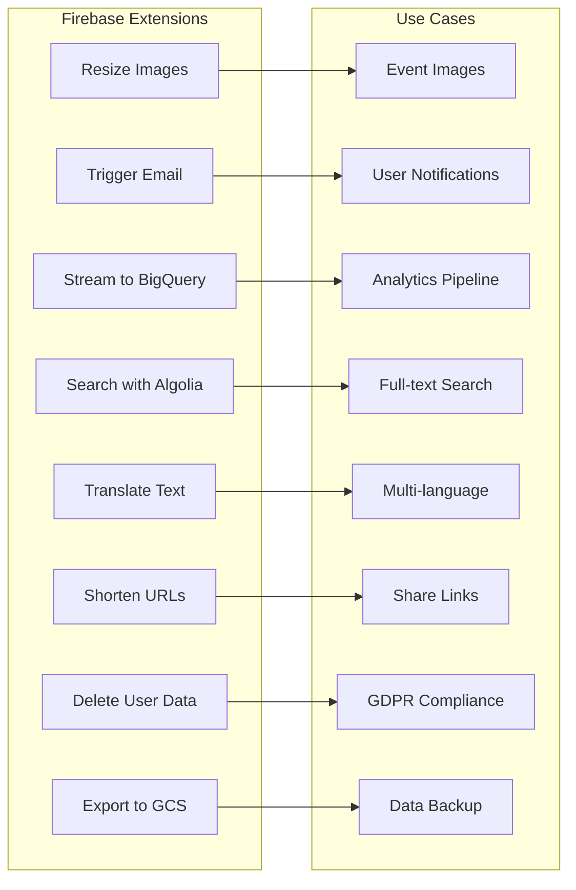

#### Extension Configurations:

```javascript
// Firebase Extensions Configuration
const extensions = {
  // Resize Images Extension
  'firebase/storage-resize-images': {
    config: {
      IMG_BUCKET: 'somethingtodoai-prod.appspot.com',
      RESIZED_IMAGES_PATH: 'thumbnails',
      INCLUDE_ORIGINAL: true,
      IMG_SIZES: '128x128,400x400,800x800',
      DELETE_ORIGINAL_FILE: false,
      IMAGE_TYPE: 'webp',
      CACHE_CONTROL_HEADER: 'max-age=86400',
    },
    trigger: 'Event images uploaded to /events/{eventId}/images/{imageId}'
  },
  
  // Trigger Email Extension
  'firebase/firestore-send-email': {
    config: {
      MAIL_COLLECTION: 'mail',
      SMTP_CONNECTION_URI: '${param:SMTP_CONNECTION_URI}',
      DEFAULT_FROM: 'noreply@somethingtodoai.com',
      TEMPLATES_COLLECTION: 'email_templates',
    },
    templates: {
      welcome: {
        subject: 'Welcome to SomethingToDoAI!',
        html: '<h1>Welcome {{displayName}}!</h1>...',
        text: 'Welcome {{displayName}}!...'
      },
      event_reminder: {
        subject: 'Event Reminder: {{eventTitle}}',
        html: '<p>Your event {{eventTitle}} starts in 1 hour!</p>',
      },
      weekly_digest: {
        subject: 'Your Weekly Events Digest',
        html: '{{#each events}}<div>{{title}} - {{date}}</div>{{/each}}'
      }
    }
  },
  
  // Stream Firestore to BigQuery
  'firebase/firestore-bigquery-export': {
    config: {
      COLLECTION_PATH: 'analytics',
      DATASET_ID: 'somethingtodoai_analytics',
      TABLE_ID: 'events',
      TRANSFORM_FUNCTION: 'transformAnalyticsData',
      CLUSTERING_FIELDS: 'userId,eventName,timestamp',
    }
  },
  
  // Search with Algolia
  'algolia/firestore-algolia-search': {
    config: {
      COLLECTION_PATH: 'events',
      ALGOLIA_APP_ID: '${param:ALGOLIA_APP_ID}',
      ALGOLIA_API_KEY: '${param:ALGOLIA_API_KEY}',
      ALGOLIA_INDEX_NAME: 'events_index',
      FIELDS: 'title,description,categories,tags,venue.name',
      TRANSFORM_FUNCTION: 'transformEventForSearch',
    }
  }
};
```

### 5.3 Advanced Firebase Features

#### 5.3.1 Firebase App Check Integration

```dart
// lib/services/app_check_service.dart
import 'package:firebase_app_check/firebase_app_check.dart';

class AppCheckService {
  static Future<void> initialize() async {
    await FirebaseAppCheck.instance.activate(
      // Use debug provider for development
      androidProvider: kDebugMode 
        ? AndroidProvider.debug 
        : AndroidProvider.playIntegrity,
      appleProvider: kDebugMode 
        ? AppleProvider.debug 
        : AppleProvider.appAttest,
      webRecaptchaSiteKey: 'YOUR_RECAPTCHA_SITE_KEY',
    );
    
    // Get token for custom backend calls
    final token = await FirebaseAppCheck.instance.getToken();
    print('App Check token: ${token?.token}');
    
    // Listen to token changes
    FirebaseAppCheck.instance.onTokenChange.listen((token) {
      print('App Check token refreshed');
      // Update any custom backend calls with new token
    });
  }
}

// Cloud Function to verify App Check
export const protectedFunction = functions.https.onCall(async (data, context) => {
  // Check for App Check token
  if (context.app == undefined) {
    throw new functions.https.HttpsError(
      'failed-precondition',
      'The function must be called from an App Check verified app.'
    );
  }
  
  // Proceed with function logic
  return { message: 'Success! This request came from an App Check verified app.' };
});
```

#### 5.3.2 Firebase Dynamic Links

```dart
// lib/services/dynamic_links_service.dart
import 'package:firebase_dynamic_links/firebase_dynamic_links.dart';

class DynamicLinksService {
  static final String _domainUriPrefix = 'https://somethingtodoai.page.link';
  
  // Create a dynamic link for sharing events
  static Future<String> createEventLink(String eventId) async {
    final DynamicLinkParameters parameters = DynamicLinkParameters(
      uriPrefix: _domainUriPrefix,
      link: Uri.parse('https://app.somethingtodoai.com/event/$eventId'),
      androidParameters: AndroidParameters(
        packageName: 'com.somethingtodoai.app',
        minimumVersion: 1,
        fallbackUrl: Uri.parse('https://play.google.com/store/apps/details?id=com.somethingtodoai.app'),
      ),
      iosParameters: IOSParameters(
        bundleId: 'com.somethingtodoai.app',
        minimumVersion: '1.0.0',
        appStoreId: '123456789',
        fallbackUrl: Uri.parse('https://apps.apple.com/app/id123456789'),
      ),
      socialMetaTagParameters: SocialMetaTagParameters(
        title: 'Check out this event!',
        description: 'Found this amazing event on SomethingToDoAI',
        imageUrl: Uri.parse('https://somethingtodoai.com/images/share.png'),
      ),
      googleAnalyticsParameters: GoogleAnalyticsParameters(
        campaign: 'event_share',
        medium: 'social',
        source: 'in_app',
      ),
    );
    
    final ShortDynamicLink shortLink = await FirebaseDynamicLinks.instance
        .buildShortLink(parameters);
    
    return shortLink.shortUrl.toString();
  }
  
  // Handle incoming dynamic links
  static Future<void> initDynamicLinks() async {
    // Handle link when app is already open
    FirebaseDynamicLinks.instance.onLink.listen((dynamicLinkData) {
      _handleDynamicLink(dynamicLinkData);
    }).onError((error) {
      print('Dynamic Link error: $error');
    });
    
    // Handle link when app is opened from terminated state
    final PendingDynamicLinkData? initialLink = 
        await FirebaseDynamicLinks.instance.getInitialLink();
    
    if (initialLink != null) {
      _handleDynamicLink(initialLink);
    }
  }
  
  static void _handleDynamicLink(PendingDynamicLinkData data) {
    final Uri deepLink = data.link;
    
    // Parse the link and navigate
    if (deepLink.pathSegments.contains('event')) {
      final eventId = deepLink.pathSegments.last;
      NavigationService.navigateToEvent(eventId);
      
      // Track analytics
      FirebaseAnalytics.instance.logEvent(
        name: 'dynamic_link_opened',
        parameters: {
          'link_type': 'event',
          'event_id': eventId,
          'utm_source': data.utmParameters?.source,
          'utm_medium': data.utmParameters?.medium,
          'utm_campaign': data.utmParameters?.campaign,
        },
      );
    }
  }
}
```

#### 5.3.3 Firebase ML Kit Integration

```dart
// lib/services/ml_service.dart
import 'package:google_mlkit_text_recognition/google_mlkit_text_recognition.dart';
import 'package:google_mlkit_language_id/google_mlkit_language_id.dart';
import 'package:google_mlkit_translation/google_mlkit_translation.dart';

class MLService {
  static final textRecognizer = TextRecognizer();
  static final languageIdentifier = LanguageIdentifier(confidenceThreshold: 0.5);
  
  // Scan event posters for text
  static Future<Event?> scanEventPoster(String imagePath) async {
    final inputImage = InputImage.fromFilePath(imagePath);
    final RecognizedText recognizedText = await textRecognizer.processImage(inputImage);
    
    // Extract event details from text
    String fullText = recognizedText.text;
    
    // Use regex to find dates, times, venues
    final datePattern = RegExp(r'\b\d{1,2}[/-]\d{1,2}[/-]\d{2,4}\b');
    final timePattern = RegExp(r'\b\d{1,2}:\d{2}\s*(?:AM|PM|am|pm)?\b');
    final pricePattern = RegExp(r'\$\d+(?:\.\d{2})?');
    
    final dates = datePattern.allMatches(fullText);
    final times = timePattern.allMatches(fullText);
    final prices = pricePattern.allMatches(fullText);
    
    // Send to Gemini for better parsing
    final geminiResult = await _parseWithGemini(fullText);
    
    return geminiResult;
  }
  
  // Auto-translate event descriptions
  static Future<String> translateText(String text, String targetLanguage) async {
    // First identify the language
    final String detectedLang = await languageIdentifier.identifyLanguage(text);
    
    if (detectedLang == targetLanguage || detectedLang == 'und') {
      return text;
    }
    
    // Create translator
    final translator = OnDeviceTranslator(
      sourceLanguage: TranslateLanguage.values.firstWhere(
        (lang) => lang.bcpCode == detectedLang,
        orElse: () => TranslateLanguage.english,
      ),
      targetLanguage: TranslateLanguage.values.firstWhere(
        (lang) => lang.bcpCode == targetLanguage,
        orElse: () => TranslateLanguage.english,
      ),
    );
    
    final translatedText = await translator.translateText(text);
    translator.close();
    
    return translatedText;
  }
  
  // Smart reply suggestions for chat
  static Future<List<String>> generateSmartReplies(String lastMessage) async {
    // This would integrate with Firebase ML's Smart Reply API
    // For now, return context-aware suggestions
    
    if (lastMessage.toLowerCase().contains('tonight')) {
      return [
        'Show me all events tonight',
        'What time does it start?',
        'Any free events tonight?'
      ];
    } else if (lastMessage.toLowerCase().contains('music')) {
      return [
        'Live music venues nearby',
        'Concert tickets available?',
        'Jazz or Rock events?'
      ];
    }
    
    return [
      'Tell me more',
      'Show on map',
      'Save this event'
    ];
  }
  
  static Future<Event?> _parseWithGemini(String text) async {
    // Implementation would send to Gemini for parsing
    // This is a placeholder
    return null;
  }
}
```

### 5.4 Firebase Performance Optimization

#### 5.4.1 Firestore Query Optimization

```typescript
// Cloud Function - Optimized Event Queries
import * as functions from 'firebase-functions/v2';
import * as admin from 'firebase-admin';
import * as geofirestore from 'geofirestore';

// Initialize GeoFirestore for location queries
const geoFirestore = geofirestore.initializeApp(admin.firestore());
const geoEventsCollection = geoFirestore.collection('events');

// Composite indexes for common queries
// Deploy with: firebase deploy --only firestore:indexes
const firestoreIndexes = {
  events: [
    {
      collectionGroup: "events",
      queryScope: "COLLECTION",
      fields: [
        { fieldPath: "startTime", order: "ASCENDING" },
        { fieldPath: "categories", arrayConfig: "CONTAINS" },
        { fieldPath: "venue.geopoint", order: "ASCENDING" }
      ]
    },
    {
      collectionGroup: "events",
      queryScope: "COLLECTION",
      fields: [
        { fieldPath: "isFeatured", order: "DESCENDING" },
        { fieldPath: "startTime", order: "ASCENDING" },
        { fieldPath: "viewCount", order: "DESCENDING" }
      ]
    }
  ]
};

// Optimized nearby events query using GeoFirestore
export const getNearbyEvents = functions.https.onCall(async (data, context) => {
  const { lat, lon, radius, category, startDate, endDate } = data;
  
  // Use GeoFirestore for efficient location queries
  const geoQuery = geoEventsCollection.near({
    center: new admin.firestore.GeoPoint(lat, lon),
    radius: radius // in kilometers
  });
  
  // Add additional filters
  let query = geoQuery.where('startTime', '>=', startDate);
  
  if (endDate) {
    query = query.where('startTime', '<=', endDate);
  }
  
  if (category) {
    query = query.where('categories', 'array-contains', category);
  }
  
  // Limit for performance
  query = query.limit(50);
  
  // Execute with performance tracking
  const trace = functions.trace('getNearbyEvents');
  trace.start();
  
  try {
    const snapshot = await query.get();
    const events = snapshot.docs.map(doc => ({
      id: doc.id,
      ...doc.data(),
      distance: doc.distance // Added by GeoFirestore
    }));
    
    trace.stop();
    
    // Cache in Firestore for quick retrieval
    const cacheKey = `${lat}_${lon}_${radius}_${category}`;
    await admin.firestore().collection('queryCache').doc(cacheKey).set({
      events,
      timestamp: admin.firestore.FieldValue.serverTimestamp(),
      expiresAt: new Date(Date.now() + 5 * 60 * 1000) // 5 minutes
    });
    
    return { events, cached: false };
  } catch (error) {
    trace.stop();
    throw error;
  }
});

// Batched writes for better performance
export const batchUpdateEventViews = functions.pubsub
  .schedule('every 5 minutes')
  .onRun(async (context) => {
    const viewsRef = admin.firestore().collection('eventViewsBuffer');
    const snapshot = await viewsRef.limit(500).get();
    
    if (snapshot.empty) return;
    
    const batch = admin.firestore().batch();
    const eventViews = new Map<string, number>();
    
    // Aggregate views
    snapshot.forEach(doc => {
      const { eventId, count } = doc.data();
      eventViews.set(eventId, (eventViews.get(eventId) || 0) + count);
      batch.delete(doc.ref);
    });
    
    // Update events
    for (const [eventId, views] of eventViews) {
      const eventRef = admin.firestore().collection('events').doc(eventId);
      batch.update(eventRef, {
        viewCount: admin.firestore.FieldValue.increment(views)
      });
    }
    
    await batch.commit();
    console.log(`Updated view counts for ${eventViews.size} events`);
  });
```

#### 5.4.2 Firebase Storage Optimization

```typescript
// Optimized image handling
export const optimizeEventImages = functions.storage.object().onFinalize(async (object) => {
  const filePath = object.name;
  const contentType = object.contentType;
  
  // Only process images
  if (!contentType?.startsWith('image/')) return;
  
  // Skip already processed images
  if (filePath?.includes('optimized/')) return;
  
  const bucket = admin.storage().bucket(object.bucket);
  const fileName = path.basename(filePath!);
  const tempFilePath = path.join(os.tmpdir(), fileName);
  
  // Download file
  await bucket.file(filePath!).download({ destination: tempFilePath });
  
  // Generate multiple sizes
  const sizes = [
    { name: 'thumb', width: 200, height: 200 },
    { name: 'small', width: 400, height: 400 },
    { name: 'medium', width: 800, height: 800 },
    { name: 'large', width: 1200, height: 1200 }
  ];
  
  const uploadPromises = sizes.map(async (size) => {
    const outputPath = path.join(os.tmpdir(), `${size.name}_${fileName}`);
    
    // Resize with sharp
    await sharp(tempFilePath)
      .resize(size.width, size.height, {
        fit: 'inside',
        withoutEnlargement: true
      })
      .webp({ quality: 85 })
      .toFile(outputPath);
    
    // Upload optimized version
    const destination = `optimized/${size.name}/${fileName}.webp`;
    await bucket.upload(outputPath, {
      destination,
      metadata: {
        contentType: 'image/webp',
        cacheControl: 'public, max-age=31536000',
        metadata: {
          optimized: 'true',
          originalFile: filePath
        }
      }
    });
    
    // Clean up temp file
    fs.unlinkSync(outputPath);
    
    return destination;
  });
  
  const optimizedPaths = await Promise.all(uploadPromises);
  
  // Update Firestore with optimized image URLs
  const eventId = filePath!.split('/')[1]; // Assumes path: events/{eventId}/images/{filename}
  await admin.firestore().collection('events').doc(eventId).update({
    optimizedImages: optimizedPaths.map(path => 
      `https://storage.googleapis.com/${object.bucket}/${path}`
    ),
    imageProcessedAt: admin.firestore.FieldValue.serverTimestamp()
  });
  
  // Clean up original temp file
  fs.unlinkSync(tempFilePath);
});
```

### 5.5 Firebase Cost Optimization

```yaml
cost_optimization_strategies:
  firestore:
    - use_aggregation_queries: Count documents without reading all
    - implement_pagination: Limit 20-50 documents per query
    - cache_frequently_accessed: Use local cache and CDN
    - batch_operations: Group writes to reduce operations
    - optimize_indexes: Only create necessary composite indexes
    - use_collection_groups: For cross-collection queries
    
  cloud_functions:
    - set_min_instances: 0 for non-critical functions
    - use_regional_deployment: Deploy close to users
    - implement_caching: Cache responses for 5-60 minutes
    - optimize_cold_starts: Lazy load dependencies
    - use_pub_sub_batching: Process multiple events together
    
  storage:
    - implement_lifecycle_rules: Delete old files automatically
    - use_compression: WebP for images, gzip for text
    - cdn_caching: Set appropriate cache headers
    - limit_file_sizes: Max 5MB per upload
    
  authentication:
    - implement_rate_limiting: Prevent abuse
    - use_anonymous_auth: For non-registered users
    - clean_inactive_users: Delete after 90 days
    
  monitoring:
    - set_budget_alerts: Daily/monthly thresholds
    - use_firebase_emulator: For development
    - implement_usage_quotas: Per-user limits

estimated_monthly_costs:
  users_10k:
    firestore_reads: $6  # 20M reads
    firestore_writes: $2  # 2M writes  
    firestore_storage: $0.18  # 1GB
    cloud_functions: $5  # 2M invocations
    storage: $0.26  # 10GB
    auth: $0  # Free tier
    total: ~$14
    
  users_100k:
    firestore_reads: $60
    firestore_writes: $20
    firestore_storage: $1.80
    cloud_functions: $50
    storage: $2.60
    auth: $55  # Phone auth
    total: ~$190
    
  users_1m:
    firestore_reads: $600
    firestore_writes: $200  
    firestore_storage: $18
    cloud_functions: $500
    storage: $26
    auth: $550
    total: ~$1,894
```

### 5.6 Firebase Local Development

```javascript
// firebase.json - Emulator Configuration
{
  "emulators": {
    "auth": {
      "port": 9099,
      "host": "127.0.0.1"
    },
    "functions": {
      "port": 5001,
      "host": "127.0.0.1"
    },
    "firestore": {
      "port": 8080,
      "host": "127.0.0.1"
    },
    "storage": {
      "port": 9199,
      "host": "127.0.0.1"
    },
    "pubsub": {
      "port": 8085,
      "host": "127.0.0.1"
    },
    "ui": {
      "enabled": true,
      "port": 4000
    }
  },
  "firestore": {
    "rules": "firestore.rules",
    "indexes": "firestore.indexes.json"
  },
  "functions": {
    "source": "functions",
    "runtime": "nodejs20",
    "ignore": [
      "node_modules",
      ".git",
      "**/*.test.ts"
    ]
  },
  "storage": {
    "rules": "storage.rules"
  },
  "hosting": {
    "public": "build",
    "ignore": ["firebase.json", "**/.*", "**/node_modules/**"],
    "rewrites": [
      {
        "source": "**",
        "destination": "/index.html"
      }
    ],
    "headers": [
      {
        "source": "**/*.@(webp|jpg|jpeg|gif|png)",
        "headers": [
          {
            "key": "Cache-Control",
            "value": "public, max-age=31536000"
          }
        ]
      }
    ]
  }
}

// Flutter app - Connect to emulators
void main() async {
  WidgetsFlutterBinding.ensureInitialized();
  await Firebase.initializeApp();
  
  if (kDebugMode) {
    // Connect to Firebase Emulators
    await FirebaseAuth.instance.useAuthEmulator('localhost', 9099);
    FirebaseFirestore.instance.useFirestoreEmulator('localhost', 8080);
    FirebaseFunctions.instance.useFunctionsEmulator('localhost', 5001);
    await FirebaseStorage.instance.useStorageEmulator('localhost', 9199);
    
    // Disable App Check in development
    await FirebaseAppCheck.instance.activate(
      androidProvider: AndroidProvider.debug,
      appleProvider: AppleProvider.debug,
    );
  }
  
  runApp(MyApp());
}

// Seed data for local development
async function seedEmulator() {
  const auth = getAuth();
  const db = getFirestore();
  
  // Create test users
  const testUsers = [
    { email: 'user@test.com', password: 'password123' },
    { email: 'premium@test.com', password: 'password123', isPremium: true }
  ];
  
  for (const testUser of testUsers) {
    const userCredential = await createUserWithEmailAndPassword(
      auth, 
      testUser.email, 
      testUser.password
    );
    
    await db.collection('users').doc(userCredential.user.uid).set({
      email: testUser.email,
      isPremium: testUser.isPremium || false,
      createdAt: serverTimestamp()
    });
  }
  
  // Create test events
  const testEvents = generateTestEvents(100);
  const batch = db.batch();
  
  testEvents.forEach((event) => {
    const docRef = db.collection('events').doc();
    batch.set(docRef, event);
  });
  
  await batch.commit();
  console.log('Emulator seeded with test data');
}
```

### 5.7 Firebase CI/CD Pipeline

```yaml
# .github/workflows/firebase-deploy.yml
name: Deploy to Firebase

on:
  push:
    branches: [main, develop]
  pull_request:
    branches: [main]

jobs:
  test:
    runs-on: ubuntu-latest
    steps:
      - uses: actions/checkout@v3
      
      - name: Setup Node.js
        uses: actions/setup-node@v3
        with:
          node-version: '20'
          
      - name: Install dependencies
        run: |
          npm ci --prefix functions
          npm ci --prefix hosting
          
      - name: Run tests
        run: |
          npm test --prefix functions
          npm run test:firestore:rules
          
      - name: Run Firebase Emulators
        run: |
          npm install -g firebase-tools
          firebase emulators:exec --only firestore,functions,auth \
            "npm run test:integration --prefix functions"
            
  deploy-staging:
    needs: test
    if: github.ref == 'refs/heads/develop'
    runs-on: ubuntu-latest
    steps:
      - uses: actions/checkout@v3
      
      - name: Deploy to Staging
        uses: w9jds/firebase-action@master
        with:
          args: deploy --only firestore:rules,functions,hosting --project somethingtodoai-staging
        env:
          FIREBASE_TOKEN: ${{ secrets.FIREBASE_TOKEN }}
          
  deploy-production:
    needs: test
    if: github.ref == 'refs/heads/main'
    runs-on: ubuntu-latest
    environment: production
    steps:
      - uses: actions/checkout@v3
      
      - name: Deploy Security Rules
        uses: w9jds/firebase-action@master
        with:
          args: deploy --only firestore:rules,storage:rules --project somethingtodoai-prod
        env:
          FIREBASE_TOKEN: ${{ secrets.FIREBASE_TOKEN }}
          
      - name: Deploy Cloud Functions
        uses: w9jds/firebase-action@master
        with:
          args: deploy --only functions --project somethingtodoai-prod
        env:
          FIREBASE_TOKEN: ${{ secrets.FIREBASE_TOKEN }}
          
      - name: Deploy Hosting
        uses: w9jds/firebase-action@master
        with:
          args: deploy --only hosting --project somethingtodoai-prod
        env:
          FIREBASE_TOKEN: ${{ secrets.FIREBASE_TOKEN }}
          
      - name: Run E2E Tests
        run: npm run test:e2e
        
      - name: Notify Deployment
        uses: 8398a7/action-slack@v3
        with:
          status: ${{ job.status }}
          text: 'Production deployment completed'
          webhook_url: ${{ secrets.SLACK_WEBHOOK }}
```

### 5.8 Firebase Monitoring & Observability

```typescript
// Cloud Function - Custom Monitoring
import * as functions from 'firebase-functions/v2';
import { Logging } from '@google-cloud/logging';
import { Monitoring } from '@google-cloud/monitoring';

const logging = new Logging();
const monitoring = new Monitoring.MetricServiceClient();

// Custom metrics
export const trackCustomMetrics = functions.pubsub
  .schedule('every 5 minutes')
  .onRun(async (context) => {
    const projectId = process.env.GCLOUD_PROJECT;
    
    // Track active users
    const activeUsers = await getActiveUserCount();
    await writeMetric(projectId!, 'active_users', activeUsers);
    
    // Track API usage
    const apiUsage = await getApiUsageStats();
    await writeMetric(projectId!, 'api_calls_per_minute', apiUsage.callsPerMinute);
    await writeMetric(projectId!, 'api_error_rate', apiUsage.errorRate);
    
    // Track cache performance
    const cacheStats = await getCacheStats();
    await writeMetric(projectId!, 'cache_hit_ratio', cacheStats.hitRatio);
    
    // Log summary
    const log = logging.log('metrics-summary');
    const metadata = {
      resource: { type: 'cloud_function' },
      severity: 'INFO'
    };
    
    const entry = log.entry(metadata, {
      activeUsers,
      apiUsage,
      cacheStats,
      timestamp: new Date().toISOString()
    });
    
    await log.write(entry);
  });

// Alert on anomalies
export const detectAnomalies = functions.firestore
  .document('analytics/{docId}')
  .onCreate(async (snapshot, context) => {
    const data = snapshot.data();
    
    // Check for suspicious patterns
    if (data.eventName === 'api_error' && data.properties?.errorRate > 0.1) {
      await sendAlert({
        severity: 'HIGH',
        message: `High API error rate detected: ${data.properties.errorRate}`,
        metadata: data
      });
    }
    
    if (data.eventName === 'user_churn' && data.properties?.churnRate > 0.05) {
      await sendAlert({
        severity: 'MEDIUM',
        message: `Elevated churn rate: ${data.properties.churnRate}`,
        metadata: data
      });
    }
  });

// Performance tracking
export const trackPerformance = functions.https.onRequest(async (req, res) => {
  const trace = functions.trace('api_request');
  trace.start();
  
  try {
    // Set custom attributes
    trace.setAttribute('endpoint', req.path);
    trace.setAttribute('method', req.method);
    trace.setAttribute('user_agent', req.headers['user-agent'] || 'unknown');
    
    // Process request
    const result = await processRequest(req);
    
    trace.setAttribute('response_size', JSON.stringify(result).length);
    trace.setAttribute('success', true);
    
    res.json(result);
  } catch (error) {
    trace.setAttribute('success', false);
    trace.setAttribute('error', error.message);
    
    res.status(500).json({ error: error.message });
  } finally {
    trace.stop();
  }
});
```

### 5.9 Firebase Security Best Practices

```javascript
// Advanced Security Rules
rules_version = '2';
service cloud.firestore {
  match /databases/{database}/documents {
    // Security Functions
    function isSignedIn() {
      return request.auth != null;
    }
    
    function emailVerified() {
      return request.auth.token.email_verified;
    }
    
    function hasRole(role) {
      return request.auth.token.role == role;
    }
    
    function isOwner(userId) {
      return request.auth.uid == userId;
    }
    
    function isPremiumUser() {
      return isSignedIn() && 
        get(/databases/$(database)/documents/users/$(request.auth.uid)).data.isPremium == true &&
        get(/databases/$(database)/documents/users/$(request.auth.uid)).data.premiumExpiresAt > request.time;
    }
    
    function rateLimitNotExceeded() {
      return !exists(/databases/$(database)/documents/rateLimits/$(request.auth.uid)) ||
        get(/databases/$(database)/documents/rateLimits/$(request.auth.uid)).data.count < 100;
    }
    
    function validEventData() {
      let data = request.resource.data;
      return data.title is string &&
        data.title.size() > 0 &&
        data.title.size() <= 200 &&
        data.startTime is timestamp &&
        data.startTime > request.time &&
        data.venue is map &&
        data.venue.keys().hasAll(['name', 'geopoint']) &&
        data.categories is list &&
        data.categories.size() <= 5;
    }
    
    // Apply rules with defense in depth
    match /users/{userId} {
      allow read: if isSignedIn() && (isOwner(userId) || hasRole('admin'));
      allow create: if isSignedIn() && isOwner(userId) && emailVerified();
      allow update: if isSignedIn() && isOwner(userId) && 
        !request.resource.data.diff(resource.data).affectedKeys()
          .hasAny(['isPremium', 'role', 'credits']);
      allow delete: if false; // Soft delete only
    }
    
    match /events/{eventId} {
      allow read: if true; // Public
      allow create: if isSignedIn() && 
        (hasRole('organizer') || hasRole('admin')) &&
        validEventData() &&
        rateLimitNotExceeded();
      allow update: if isSignedIn() && 
        (resource.data.organizerId == request.auth.uid || hasRole('admin'));
      allow delete: if hasRole('admin');
    }
    
    // Secure subcollections
    match /users/{userId}/favorites/{eventId} {
      allow read: if isSignedIn() && isOwner(userId);
      allow write: if isSignedIn() && isOwner(userId) && 
        request.resource.data.keys().hasAll(['eventRef', 'savedAt']);
    }
    
    // Admin-only collections
    match /config/{document=**} {
      allow read: if true;
      allow write: if hasRole('admin');
    }
    
    match /analytics/{document=**} {
      allow read: if hasRole('admin');
      allow create: if isSignedIn();
      allow update, delete: if false;
    }
  }
}

// Storage Security Rules
rules_version = '2';
service firebase.storage {
  match /b/{bucket}/o {
    function isSignedIn() {
      return request.auth != null;
    }
    
    function isOwner(userId) {
      return request.auth.uid == userId;
    }
    
    function isImageFile() {
      return request.resource.contentType.matches('image/.*');
    }
    
    function isValidSize() {
      return request.resource.size < 5 * 1024 * 1024; // 5MB
    }
    
    // User profile images
    match /users/{userId}/profile/{fileName} {
      allow read: if true;
      allow write: if isSignedIn() && 
        isOwner(userId) && 
        isImageFile() && 
        isValidSize();
    }
    
    // Event images
    match /events/{eventId}/images/{fileName} {
      allow read: if true;
      allow write: if isSignedIn() && 
        isImageFile() && 
        isValidSize() &&
        firestore.get(/databases/(default)/documents/events/$(eventId))
          .data.organizerId == request.auth.uid;
    }
    
    // Temporary uploads
    match /temp/{userId}/{fileName} {
      allow read, write: if isSignedIn() && isOwner(userId);
      // These files are automatically deleted after 24 hours via lifecycle rule
    }
  }
}
```

### 5.10 Firebase Analytics & Conversion Tracking

```dart
// lib/services/analytics_service.dart
import 'package:firebase_analytics/firebase_analytics.dart';
import 'package:firebase_analytics/observer.dart';

class AnalyticsService {
  static final FirebaseAnalytics _analytics = FirebaseAnalytics.instance;
  static final FirebaseAnalyticsObserver observer = 
      FirebaseAnalyticsObserver(analytics: _analytics);
  
  // User Properties
  static Future<void> setUserProperties({
    required String userId,
    bool? isPremium,
    List<String>? interests,
    String? city,
    int? ageGroup,
  }) async {
    await _analytics.setUserId(id: userId);
    
    if (isPremium != null) {
      await _analytics.setUserProperty(
        name: 'is_premium',
        value: isPremium.toString(),
      );
    }
    
    if (interests != null) {
      await _analytics.setUserProperty(
        name: 'interests',
        value: interests.join(','),
      );
    }
    
    if (city != null) {
      await _analytics.setUserProperty(
        name: 'city',
        value: city,
      );
    }
    
    if (ageGroup != null) {
      await _analytics.setUserProperty(
        name: 'age_group',
        value: ageGroup.toString(),
      );
    }
  }
  
  // Conversion Events
  static Future<void> trackConversion(String conversionType, Map<String, dynamic> parameters) async {
    // Standard conversion events
    switch (conversionType) {
      case 'signup':
        await _analytics.logSignUp(signUpMethod: parameters['method'] ?? 'email');
        break;
      
      case 'premium_purchase':
        await _analytics.logPurchase(
          currency: 'USD',
          value: parameters['price'] ?? 4.99,
          items: [
            AnalyticsEventItem(
              itemId: 'premium_subscription',
              itemName: 'Premium Subscription',
              itemCategory: 'subscription',
              price: parameters['price'] ?? 4.99,
            ),
          ],
        );
        break;
      
      case 'event_ticket_click':
        await _analytics.logSelectContent(
          contentType: 'ticket_link',
          itemId: parameters['event_id'],
        );
        break;
      
      case 'share_event':
        await _analytics.logShare(
          contentType: 'event',
          itemId: parameters['event_id'],
          method: parameters['method'] ?? 'unknown',
        );
        break;
      
      default:
        await _analytics.logEvent(
          name: conversionType,
          parameters: parameters,
        );
    }
  }
  
  // Custom Funnels
  static Future<void> trackFunnelStep(String funnelName, int step, Map<String, dynamic> parameters) async {
    await _analytics.logEvent(
      name: '${funnelName}_step_$step',
      parameters: {
        'funnel_name': funnelName,
        'step': step,
        ...parameters,
      },
    );
  }
  
  // A/B Testing Events
  static Future<void> trackExperiment(String experimentName, String variant) async {
    await _analytics.logEvent(
      name: 'experiment_exposure',
      parameters: {
        'experiment_name': experimentName,
        'variant': variant,
      },
    );
  }
  
  // Screen Tracking
  static Future<void> trackScreen(String screenName, {Map<String, dynamic>? parameters}) async {
    await _analytics.logScreenView(
      screenName: screenName,
      parameters: parameters,
    );
  }
  
  // Engagement Metrics
  static Future<void> trackEngagement({
    required String action,
    required String category,
    String? label,
    int? value,
  }) async {
    await _analytics.logEvent(
      name: 'user_engagement',
      parameters: {
        'action': action,
        'category': category,
        if (label != null) 'label': label,
        if (value != null) 'value': value,
        'timestamp': DateTime.now().toIso8601String(),
      },
    );
  }
}

// Usage in app
class EventDetailsScreen extends StatelessWidget {
  final Event event;
  
  @override
  Widget build(BuildContext context) {
    // Track screen view
    AnalyticsService.trackScreen('event_details', parameters: {
      'event_id': event.id,
      'event_category': event.category,
      'is_featured': event.isFeatured,
    });
    
    return Scaffold(
      body: Column(
        children: [
          // ... event details UI
          
          ElevatedButton(
            onPressed: () {
              // Track conversion
              AnalyticsService.trackConversion('event_ticket_click', {
                'event_id': event.id,
                'event_name': event.title,
                'price': event.price,
              });
              
              // Track funnel step
              AnalyticsService.trackFunnelStep('booking_funnel', 2, {
                'event_id': event.id,
              });
              
              // Open ticket URL
              launchUrl(event.ticketUrl);
            },
            child: Text('Get Tickets'),
          ),
        ],
      ),
    );
  }
}
```

---

## 6. Firebase Disaster Recovery & Backup

```yaml
disaster_recovery_plan:
  backup_strategy:
    firestore:
      frequency: daily
      retention: 30_days
      method: gcloud firestore export
      destination: gs://somethingtodoai-backups/firestore
      automation: Cloud Scheduler + Cloud Function
    
    storage:
      cross_region_replication: true
      versioning: enabled
      lifecycle_policies:
        - delete_old_versions_after: 30_days
        - archive_to_coldline_after: 90_days
    
    auth:
      export_frequency: weekly
      includes:
        - user_accounts
        - custom_claims
        - provider_data
  
  recovery_procedures:
    rto: 4_hours  # Recovery Time Objective
    rpo: 24_hours # Recovery Point Objective
    
    steps:
      1_assess: Identify scope of failure
      2_notify: Alert team and stakeholders
      3_switch: Redirect traffic to backup project
      4_restore: Import latest backup
      5_verify: Test critical functions
      6_resume: Re-enable production traffic
    
  failover_projects:
    primary: somethingtodoai-prod
    secondary: somethingtodoai-dr
    sync_method: Cross-project Firestore replication
    
  monitoring:
    - uptime_checks: Every 1 minute
    - backup_verification: Daily automated restore test
    - alert_channels: [email, sms, slack]
```

---

## Document Summary

This expanded PRD now includes comprehensive Firebase implementation covering:

### **Architecture & Infrastructure**
- Complete Firebase service architecture with detailed diagrams
- Firestore NoSQL data models optimized for mobile
- Cloud Functions for serverless backend logic
- Firebase Extensions for common functionality

### **Development & Testing**
- Local emulator setup for offline development  
- Comprehensive security rules with RBAC
- CI/CD pipelines with GitHub Actions
- Performance optimization strategies

### **Advanced Features**
- App Check for app attestation
- Dynamic Links for deep linking
- ML Kit for image recognition and translation
- Real-time synchronization patterns

### **Operations & Monitoring**
- Cost optimization strategies with estimates
- Custom metrics and alerting
- Analytics and conversion tracking
- Disaster recovery procedures

### **Code Examples**
- Production-ready Flutter integration code
- TypeScript Cloud Functions
- Security rules with validation
- Performance monitoring

The PRD now provides a complete blueprint for building SomethingToDoAI on Firebase, from development through production deployment and scaling.# Product Requirements Document (PRD)

**Product:** SomethingToDoAI  
**Platform:** Flutter (iOS & Android)  
**Primary Data Source:** Real-Time Events Search API (OpenWeb Ninja via RapidAPI)  
**AI Engine:** Gemini 2.5 Pro  
**Version:** 2.0  
**Date:** August 30, 2025  
**Status:** Draft

---

## Executive Summary

SomethingToDoAI revolutionizes local event discovery through an intelligent, map-first mobile application that combines real-time event data with conversational AI. Users can discover events through natural language queries ("What's happening tonight?"), interactive maps, and personalized recommendations. The app leverages the Real-Time Events Search API for comprehensive event data and Gemini 2.5 Pro for intelligent, context-aware discovery.

### Key Differentiators
- **AI-First Discovery**: Natural language event search that understands context and preferences
- **Real-Time Data**: Live event updates from OpenWeb Ninja's comprehensive database
- **Map-Centric UX**: Visual discovery through interactive, location-based exploration
- **Zero-Friction Start**: No sign-up required for basic features
- **Cross-Platform Native**: Flutter-based for consistent iOS/Android experience

---

## 1. Product Vision & Strategy

### 1.1 Vision Statement
"Make discovering local experiences as simple as asking a friend what to do tonight."

### 1.2 Mission
Empower users to spontaneously discover and engage with their local community through intelligent, personalized event recommendations delivered via an intuitive mobile interface.

### 1.3 Strategic Objectives
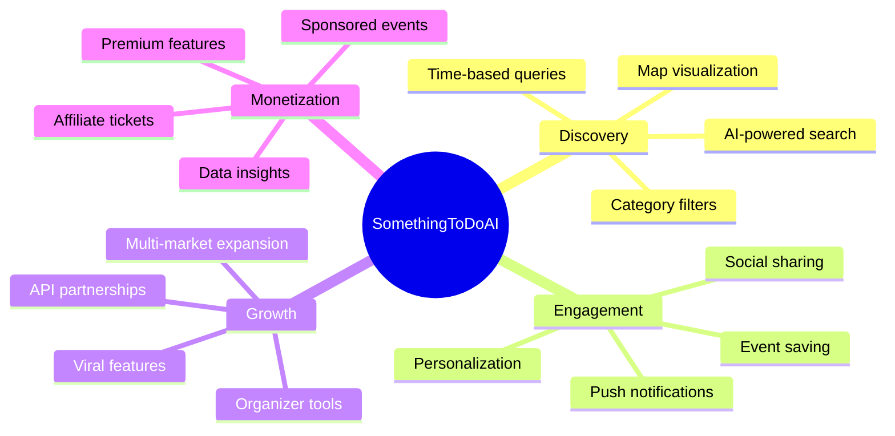

### 1.4 Success Criteria
- **Year 1**: 100K MAU, 25% D7 retention, 4+ min avg session
- **Year 2**: 500K MAU, expand to 50+ cities, launch organizer platform
- **Year 3**: 2M MAU, profitable via premium + partnerships

---

## 2. User Research & Personas

### 2.1 Primary Personas

#### Persona 1: Local Explorer (35% of users)
- **Demographics**: 22-35, urban, social, tech-savvy
- **Needs**: Spontaneous plans, trending events, nightlife
- **Pain Points**: FOMO, decision paralysis, scattered info sources
- **Usage Pattern**: 2-3x/week, evening peaks, weekend heavy

#### Persona 2: Family Planner (30% of users)
- **Demographics**: 28-45, suburban, parents with kids
- **Needs**: Kid-friendly activities, advance planning, free events
- **Pain Points**: Age-appropriate filtering, parking info, weather concerns
- **Usage Pattern**: Weekly planning sessions, weekend execution

#### Persona 3: Tourist/Traveler (20% of users)
- **Demographics**: All ages, visiting new cities
- **Needs**: Local experiences, walkable options, cultural events
- **Pain Points**: Unfamiliarity with areas, language barriers, tourist traps
- **Usage Pattern**: Intensive during trips, pre-trip planning

#### Persona 4: Event Organizer (15% of users)
- **Demographics**: Small businesses, artists, community groups
- **Needs**: Event visibility, attendee analytics, promotion tools
- **Pain Points**: Reaching target audience, competing with large events
- **Usage Pattern**: Weekly posting, daily monitoring

### 2.2 User Journey Maps

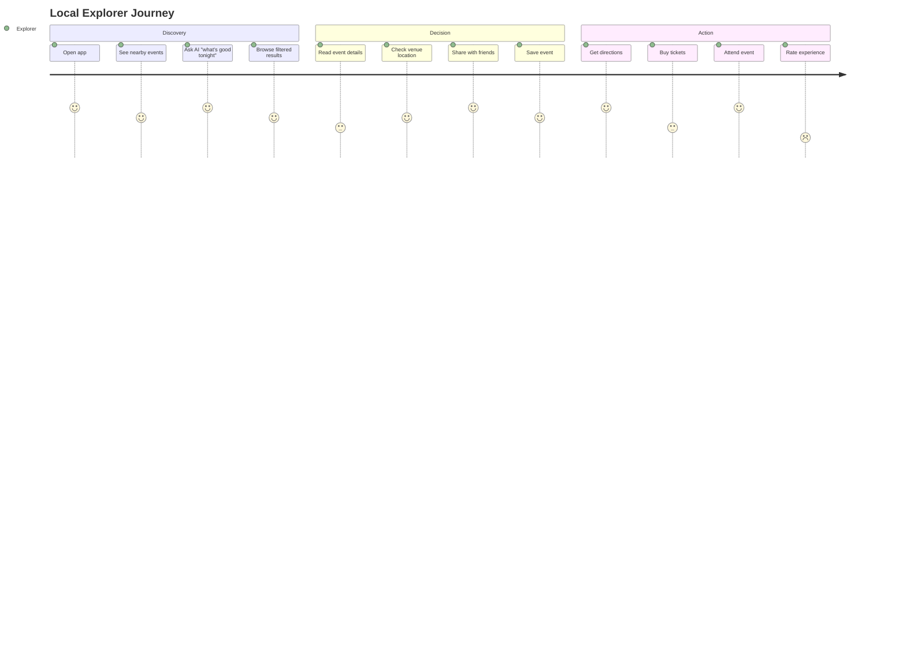

---

## 3. Feature Specifications

### 3.1 Core Features Matrix

| Feature | MVP | V1.1 | V2.0 | Priority | Complexity |
|---------|-----|------|------|----------|------------|
| Map View with Pins | ✅ | ✅ | ✅ | P0 | Medium |
| Event List View | ✅ | ✅ | ✅ | P0 | Low |
| AI Chat (Basic) | ✅ | ✅ | ✅ | P0 | High |
| Filters (Category/Date) | ✅ | ✅ | ✅ | P0 | Medium |
| Event Details | ✅ | ✅ | ✅ | P0 | Low |
| Save/Favorites | ❌ | ✅ | ✅ | P1 | Medium |
| User Accounts | ❌ | ✅ | ✅ | P1 | High |
| AI Personalization | ❌ | ❌ | ✅ | P2 | High |
| Social Features | ❌ | ❌ | ✅ | P2 | High |
| Organizer Portal | ❌ | ❌ | ✅ | P2 | Very High |
| Push Notifications | ❌ | ✅ | ✅ | P1 | Medium |
| Offline Mode | ❌ | ✅ | ✅ | P1 | Medium |
| Multi-language | ❌ | ❌ | ✅ | P3 | High |

### 3.2 Feature Deep Dives

#### 3.2.1 Map Interface
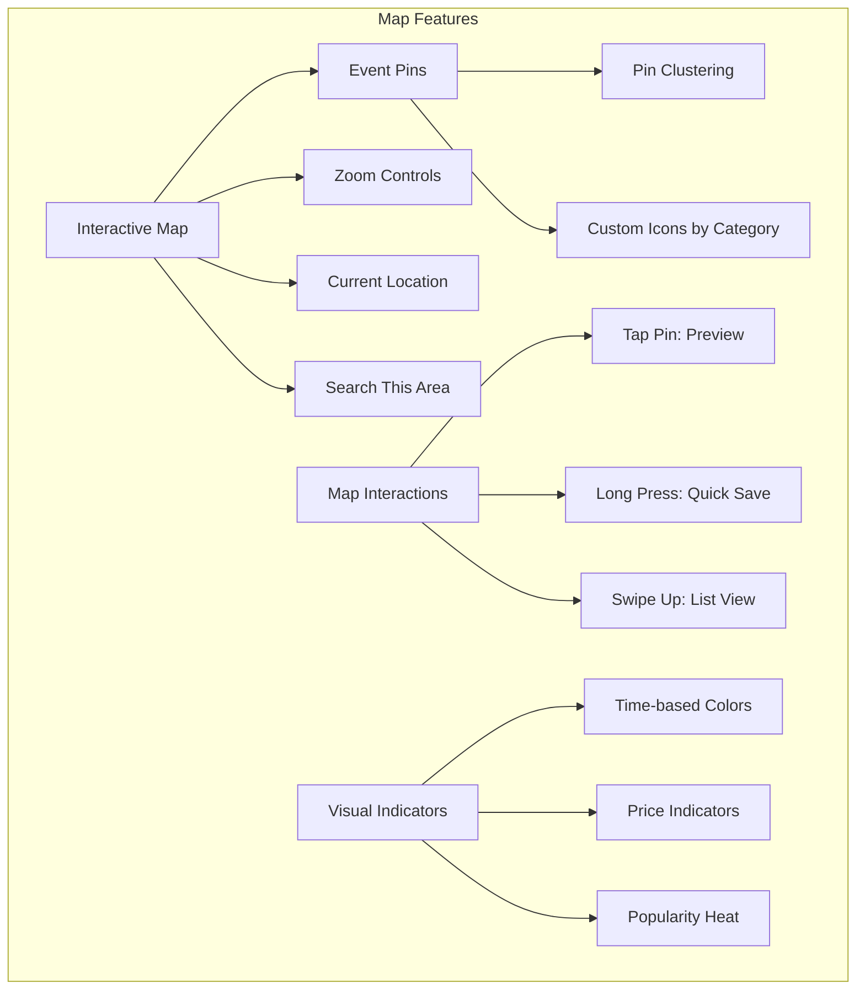

**Technical Specifications:**
- **Map Provider**: Google Maps SDK (primary) / Mapbox (fallback)
- **Pin Rendering**: Up to 500 pins with clustering above 50
- **Performance**: 60 FPS pan/zoom, <100ms pin tap response
- **Offline**: Cache last viewed area (10km radius)

#### 3.2.2 AI Chat System

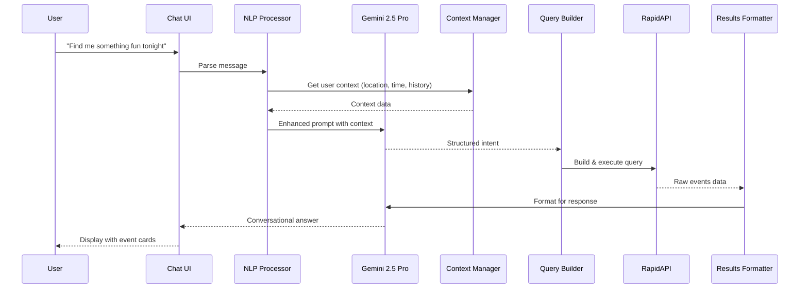

**AI Prompt Engineering:**
```yaml
system_prompt: |
  You are SomethingToDoAI's event concierge. Your role:
  1. Parse natural language into event queries
  2. Consider user context (time, location, preferences)
  3. Return 3-7 curated recommendations
  4. Be conversational but concise
  5. Always provide actionable next steps

intent_schema:
  when: 
    - tonight/today/tomorrow
    - this_weekend
    - specific_date
    - date_range
  where:
    - current_location
    - specific_address
    - city_name
    - radius_km
  what:
    - categories[]
    - keywords[]
    - vibe (casual/formal/family/romantic)
  constraints:
    - price_range
    - accessibility
    - duration
```

#### 3.2.3 Event Data Model

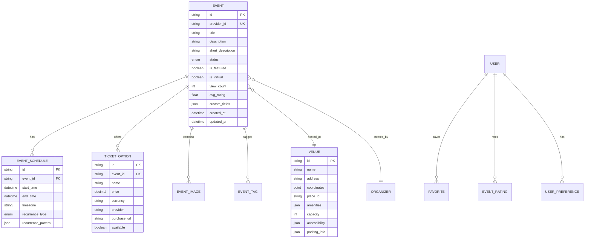

---

## 4. Technical Architecture

### 4.1 Firebase-Centric Architecture

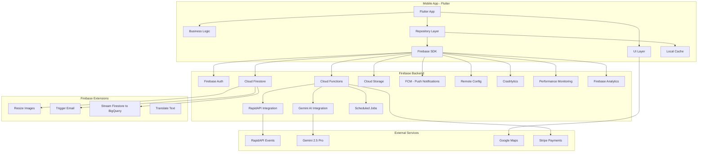

### 4.2 Technology Stack

#### Frontend (Mobile)
```yaml
framework: Flutter 3.24+
language: Dart 3.5
state_management: Riverpod 2.0
navigation: GoRouter
firebase_packages:
  - firebase_core: ^2.24.0
  - firebase_auth: ^4.15.0
  - cloud_firestore: ^4.13.0
  - firebase_storage: ^11.5.0
  - firebase_messaging: ^14.7.0
  - firebase_analytics: ^10.7.0
  - firebase_crashlytics: ^3.4.0
  - firebase_performance: ^0.9.3
  - firebase_remote_config: ^4.3.0
  - firebase_app_check: ^0.3.0
local_storage: 
  - hive_flutter: ^1.1.0 (offline cache)
  - flutter_secure_storage: ^9.0.0 (sensitive data)
maps: 
  - google_maps_flutter: ^2.5.0
ui_components:
  - Material 3
  - flutter_animate: ^4.3.0
  - lottie: ^2.7.0
```

#### Firebase Backend Services
```yaml
core_services:
  authentication:
    providers:
      - email/password
      - google
      - apple
      - anonymous
    features:
      - multi-factor authentication
      - custom claims for roles
      - session management
  
  database:
    service: Cloud Firestore
    structure: NoSQL document-based
    features:
      - real-time sync
      - offline persistence
      - compound queries
      - collection group queries
    
  serverless:
    service: Cloud Functions (Gen 2)
    runtime: Node.js 20
    triggers:
      - https (REST/callable)
      - firestore (document changes)
      - auth (user lifecycle)
      - pubsub (scheduled tasks)
      - storage (file uploads)
    
  storage:
    service: Cloud Storage
    use_cases:
      - user profile images
      - event images
      - cached API responses
      - export data
    
  messaging:
    service: Firebase Cloud Messaging
    features:
      - topic subscriptions
      - user segments
      - scheduled notifications
      - in-app messaging
    
  configuration:
    service: Remote Config
    use_cases:
      - feature flags
      - A/B testing
      - api endpoints
      - rate limits
      
monitoring:
  - crashlytics (crash reporting)
  - performance (app performance)
  - analytics (user behavior)
  - test_lab (device testing)
```

### 4.3 Firebase Data Architecture

#### 4.3.1 Firestore Collections Structure

```javascript
// Firestore Database Schema
const collections = {
  // Users collection
  users: {
    userId: {
      email: "user@example.com",
      displayName: "John Doe",
      photoURL: "https://...",
      location: new GeoPoint(40.7128, -74.0060),
      preferences: {
        categories: ["music", "food"],
        radius_km: 10,
        notifications: true
      },
      isPremium: false,
      premiumExpiresAt: Timestamp,
      createdAt: Timestamp,
      updatedAt: Timestamp,
      fcmTokens: ["token1", "token2"]
    }
  },
  
  // Events collection (cached from API)
  events: {
    eventId: {
      providerId: "rapidapi_12345",
      title: "Jazz Night",
      description: "Live jazz performance",
      startTime: Timestamp,
      endTime: Timestamp,
      venue: {
        name: "Blue Note",
        address: "131 W 3rd St",
        geopoint: new GeoPoint(40.7306, -73.9352),
        placeId: "ChIJ..."
      },
      categories: ["music", "nightlife"],
      tags: ["jazz", "live", "indoor"],
      price: {
        min: 25,
        max: 50,
        currency: "USD"
      },
      images: ["url1", "url2"],
      ticketUrl: "https://...",
      isVirtual: false,
      isFeatured: false,
      viewCount: 0,
      savedCount: 0,
      lastUpdated: Timestamp,
      expiresAt: Timestamp
    }
  },
  
  // User favorites (subcollection)
  users_userId_favorites: {
    eventId: {
      eventRef: "events/eventId",
      savedAt: Timestamp,
      reminder: Timestamp,
      notes: "Going with friends"
    }
  },
  
  // Chat sessions
  chatSessions: {
    sessionId: {
      userId: "users/userId",
      startedAt: Timestamp,
      lastMessageAt: Timestamp,
      messageCount: 0,
      context: {
        location: GeoPoint,
        preferences: {}
      }
    }
  },
  
  // Chat messages (subcollection)
  chatSessions_sessionId_messages: {
    messageId: {
      role: "user" | "assistant",
      content: "Find me something fun tonight",
      metadata: {
        events: ["eventId1", "eventId2"],
        filters: {},
        processingTime: 1250
      },
      timestamp: Timestamp
    }
  },
  
  // Analytics events
  analytics: {
    eventId: {
      userId: "users/userId",
      sessionId: "uuid",
      eventName: "event_viewed",
      properties: {
        eventId: "events/eventId",
        source: "ai_recommendation"
      },
      timestamp: Timestamp,
      platform: "ios" | "android",
      appVersion: "1.0.0"
    }
  },
  
  // App configuration (managed by Remote Config)
  config: {
    features: {
      aiChatEnabled: true,
      maxFreeChats: 10,
      premiumPrice: 4.99
    },
    api: {
      rapidApiRateLimit: 100,
      cacheTimeout: 300
    }
  }
};
```

#### 4.3.2 Cloud Functions Implementation

```typescript
// Cloud Functions for Firebase (TypeScript)
import * as functions from 'firebase-functions/v2';
import * as admin from 'firebase-admin';
import axios from 'axios';

admin.initializeApp();
const db = admin.firestore();

// HTTPS Callable Function - Search Events
export const searchEvents = functions.https.onCall(async (data, context) => {
  // Check authentication
  if (!context.auth) {
    throw new functions.https.HttpsError(
      'unauthenticated',
      'User must be authenticated'
    );
  }
  
  const { lat, lon, radius, query, filters } = data;
  
  // Check cache first
  const cacheKey = `events_${lat}_${lon}_${radius}_${query}`;
  const cached = await db.collection('cache').doc(cacheKey).get();
  
  if (cached.exists && cached.data().expiresAt > Date.now()) {
    return cached.data().events;
  }
  
  // Call RapidAPI
  try {
    const response = await axios.get(
      'https://real-time-events-search.p.rapidapi.com/search',
      {
        headers: {
          'X-RapidAPI-Key': functions.config().rapidapi.key,
          'X-RapidAPI-Host': 'real-time-events-search.p.rapidapi.com'
        },
        params: {
          lat, lon, radius, query,
          ...filters
        }
      }
    );
    
    // Store in Firestore
    const batch = db.batch();
    const events = response.data.events;
    
    events.forEach((event: any) => {
      const docRef = db.collection('events').doc(event.id);
      batch.set(docRef, {
        ...event,
        lastUpdated: admin.firestore.FieldValue.serverTimestamp(),
        expiresAt: admin.firestore.Timestamp.fromDate(
          new Date(Date.now() + 3600000) // 1 hour
        )
      }, { merge: true });
    });
    
    await batch.commit();
    
    // Update cache
    await db.collection('cache').doc(cacheKey).set({
      events: events.map((e: any) => e.id),
      expiresAt: Date.now() + 300000, // 5 minutes
      createdAt: admin.firestore.FieldValue.serverTimestamp()
    });
    
    return events;
  } catch (error) {
    console.error('RapidAPI Error:', error);
    throw new functions.https.HttpsError(
      'internal',
      'Failed to fetch events'
    );
  }
});

// Firestore Trigger - New User Setup
export const onUserCreated = functions.auth.user().onCreate(async (user) => {
  // Create user document
  await db.collection('users').doc(user.uid).set({
    email: user.email,
    displayName: user.displayName || '',
    photoURL: user.photoURL || '',
    preferences: {
      categories: [],
      radius_km: 10,
      notifications: true
    },
    isPremium: false,
    createdAt: admin.firestore.FieldValue.serverTimestamp(),
    updatedAt: admin.firestore.FieldValue.serverTimestamp()
  });
  
  // Send welcome email via Firebase Extension
  await db.collection('mail').add({
    to: user.email,
    template: {
      name: 'welcome',
      data: {
        displayName: user.displayName || 'Event Explorer'
      }
    }
  });
  
  // Log analytics
  await db.collection('analytics').add({
    userId: user.uid,
    eventName: 'user_signup',
    properties: {
      method: user.providerData[0]?.providerId || 'email'
    },
    timestamp: admin.firestore.FieldValue.serverTimestamp()
  });
});

// Scheduled Function - Clean expired events
export const cleanupExpiredEvents = functions.scheduler
  .schedule('every 1 hours')
  .onRun(async (context) => {
    const now = admin.firestore.Timestamp.now();
    const expiredEvents = await db.collection('events')
      .where('expiresAt', '<', now)
      .limit(500)
      .get();
    
    const batch = db.batch();
    expiredEvents.forEach(doc => {
      batch.delete(doc.ref);
    });
    
    await batch.commit();
    console.log(`Deleted ${expiredEvents.size} expired events`);
  });

// AI Chat Function
export const chatWithAI = functions.https.onCall(
  { 
    timeoutSeconds: 60,
    memory: '1GB' 
  },
  async (data, context) => {
    if (!context.auth) {
      throw new functions.https.HttpsError(
        'unauthenticated',
        'Authentication required'
      );
    }
    
    const { message, sessionId } = data;
    const userId = context.auth.uid;
    
    // Get user context
    const userDoc = await db.collection('users').doc(userId).get();
    const userData = userDoc.data();
    
    // Get or create session
    let sessionRef = db.collection('chatSessions').doc(sessionId);
    let session = await sessionRef.get();
    
    if (!session.exists) {
      await sessionRef.set({
        userId,
        startedAt: admin.firestore.FieldValue.serverTimestamp(),
        messageCount: 0,
        context: {
          location: userData?.location,
          preferences: userData?.preferences
        }
      });
    }
    
    // Call Gemini API
    const geminiResponse = await callGeminiAPI(message, userData);
    
    // Parse intent and search events
    const events = await searchEventsBasedOnIntent(geminiResponse.intent);
    
    // Save messages
    const batch = db.batch();
    
    // User message
    batch.create(sessionRef.collection('messages').doc(), {
      role: 'user',
      content: message,
      timestamp: admin.firestore.FieldValue.serverTimestamp()
    });
    
    // Assistant message
    batch.create(sessionRef.collection('messages').doc(), {
      role: 'assistant',
      content: geminiResponse.reply,
      metadata: {
        events: events.map((e: any) => e.id),
        intent: geminiResponse.intent
      },
      timestamp: admin.firestore.FieldValue.serverTimestamp()
    });
    
    // Update session
    batch.update(sessionRef, {
      lastMessageAt: admin.firestore.FieldValue.serverTimestamp(),
      messageCount: admin.firestore.FieldValue.increment(2)
    });
    
    await batch.commit();
    
    return {
      reply: geminiResponse.reply,
      events: events,
      sessionId: sessionId
    };
  }
);

// Helper function for Gemini API
async function callGeminiAPI(message: string, userContext: any) {
  // Implementation would go here
  // This would use the Gemini API to process the message
  return {
    reply: "I found some great events for you!",
    intent: {
      categories: ["music"],
      timeframe: "tonight",
      radius: 10
    }
  };
}

// Helper function to search events based on AI intent
async function searchEventsBasedOnIntent(intent: any) {
  // Implementation would search Firestore or call RapidAPI
  return [];
}
```

---

## 5. User Experience Design

### 5.1 Information Architecture

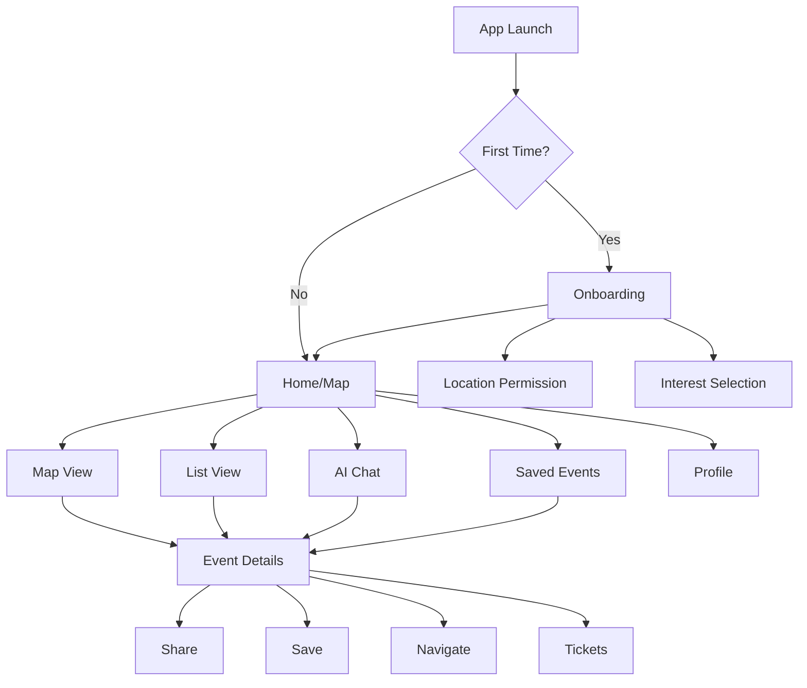

### 5.2 Screen Specifications

#### Home/Map Screen
```
┌─────────────────────────────────┐
│  📍 Current Location    🔍 ⚙️   │  <- Header
├─────────────────────────────────┤
│                                 │
│          [MAP VIEW]             │  <- Google Maps
│                                 │
│    📍    📍        📍           │  <- Event pins
│       📍     📍                 │
│                                 │
├─────────────────────────────────┤
│ Tonight │ Free │ Music │ +      │  <- Filter chips
├─────────────────────────────────┤
│ ┌─────────────────────────────┐ │
│ │ 🎵 Jazz Night               │ │  <- Event card
│ │ Tonight 8pm • Blue Note     │ │     (swipeable)
│ │ 2.3 km away • $15-30        │ │
│ └─────────────────────────────┘ │
├─────────────────────────────────┤
│  🗺️ Map   📋 List   💬 Chat    │  <- Bottom nav
└─────────────────────────────────┘
```

#### AI Chat Screen
```
┌─────────────────────────────────┐
│  💬 Event Concierge      ✕      │
├─────────────────────────────────┤
│                                 │
│  ┌───────────────────┐          │
│  │ What can I help   │          │  <- AI message
│  │ you discover?     │          │
│  └───────────────────┘          │
│                                 │
│          ┌─────────────────┐    │
│          │ Something fun   │    │  <- User message
│          │ tonight nearby? │    │
│          └─────────────────┘    │
│                                 │
│  ┌───────────────────────────┐  │
│  │ Found 3 great options:    │  │
│  │                           │  │
│  │ 1. Comedy Show @ Laugh   │  │  <- AI response
│  │    Track (8pm, $20)      │  │     with cards
│  │    [View] [Save]         │  │
│  │                           │  │
│  │ 2. Trivia Night @ Local  │  │
│  │    Pub (7:30pm, Free)    │  │
│  │    [View] [Save]         │  │
│  └───────────────────────────┘  │
│                                 │
│ ┌─────────────────────────────┐ │
│ │Tonight│Weekend│Free│Music   │ │  <- Quick chips
│ └─────────────────────────────┘ │
├─────────────────────────────────┤
│  Type a message...         📤   │  <- Input
└─────────────────────────────────┘
```

### 5.3 Design System

```yaml
colors:
  primary: 
    main: "#6B46C1"  # Purple
    light: "#9F7AEA"
    dark: "#553C9A"
  secondary:
    main: "#ED8936"  # Orange
    light: "#F6AD55"
    dark: "#C05621"
  semantic:
    success: "#48BB78"
    warning: "#F6E05E"
    error: "#F56565"
    info: "#4299E1"
  neutral:
    gray900: "#1A202C"
    gray700: "#4A5568"
    gray500: "#A0AEC0"
    gray300: "#E2E8F0"
    gray100: "#F7FAFC"

typography:
  font_family: 
    primary: "Inter"
    secondary: "Poppins"
  sizes:
    h1: 32px
    h2: 24px
    h3: 20px
    body: 16px
    caption: 14px
    small: 12px

spacing:
  unit: 8px
  scale: [0, 4, 8, 12, 16, 24, 32, 48, 64]

components:
  border_radius:
    small: 4px
    medium: 8px
    large: 16px
    full: 9999px
  shadows:
    small: "0 1px 3px rgba(0,0,0,0.12)"
    medium: "0 4px 6px rgba(0,0,0,0.1)"
    large: "0 10px 20px rgba(0,0,0,0.15)"
```

---

## 6. Data & Analytics

### 6.1 Analytics Events

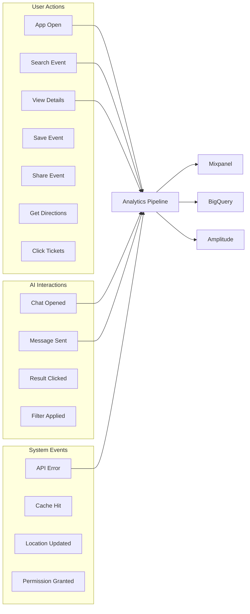

### 6.2 Key Metrics

```yaml
acquisition:
  - daily_active_users (DAU)
  - monthly_active_users (MAU)
  - new_user_acquisition_rate
  - organic_vs_paid_ratio
  - install_to_open_rate

activation:
  - time_to_first_event_view
  - onboarding_completion_rate
  - permission_grant_rate
  - first_day_events_viewed

engagement:
  - sessions_per_user
  - avg_session_duration
  - events_viewed_per_session
  - chat_usage_rate
  - filter_usage_rate
  - map_vs_list_usage

retention:
  - D1, D7, D30 retention
  - cohort_retention_curves
  - churn_rate
  - resurrection_rate

conversion:
  - event_view_to_save_rate
  - save_to_attendance_rate
  - ticket_click_rate
  - share_rate
  - ai_recommendation_acceptance

revenue:
  - average_revenue_per_user (ARPU)
  - lifetime_value (LTV)
  - conversion_to_premium
  - ad_revenue_per_mille (RPM)
```

---

## 7. Security & Compliance

### 7.1 Security Architecture

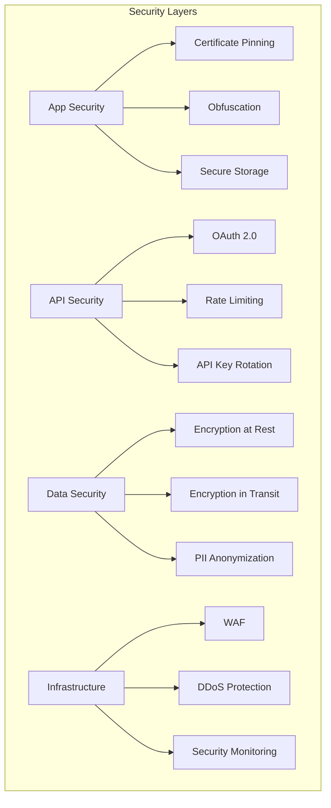

### 7.2 Privacy & Compliance

```yaml
data_privacy:
  gdpr_compliance:
    - right_to_access
    - right_to_deletion
    - data_portability
    - consent_management
  
  ccpa_compliance:
    - opt_out_of_sale
    - data_disclosure
    - non_discrimination
  
  data_retention:
    user_data: 2_years
    analytics: 1_year
    logs: 90_days
    
permissions:
  required:
    - internet_access
  optional:
    - location_when_in_use
    - push_notifications
    - camera (future: AR features)
    
third_party_data_sharing:
  - analytics: anonymized_only
  - crash_reporting: anonymized_only
  - advertising: opt_in_only
```

---

## 8. Testing Strategy

### 8.1 Test Coverage Requirements

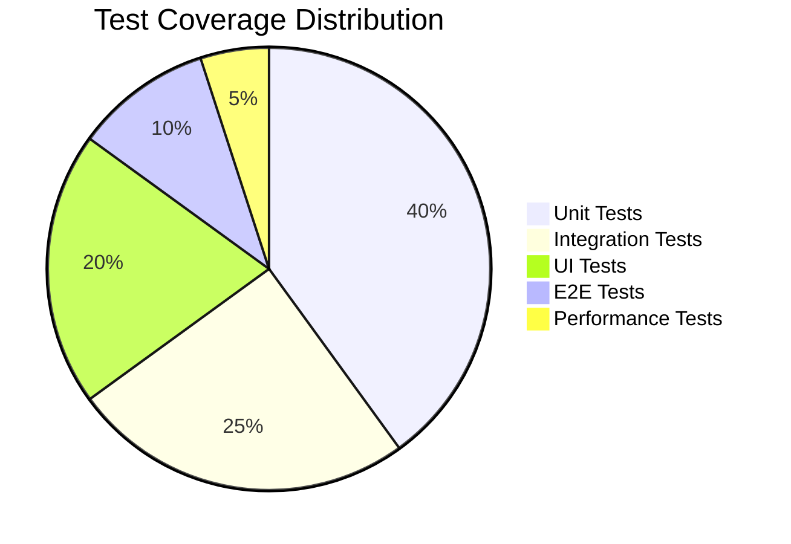

### 8.2 Testing Matrix

| Component | Unit | Integration | UI | E2E | Performance |
|-----------|------|-------------|----|----|-------------|
| Event Search | ✅ | ✅ | ✅ | ✅ | ✅ |
| AI Chat | ✅ | ✅ | ✅ | ✅ | ⚠️ |
| Map View | ✅ | ✅ | ✅ | ✅ | ✅ |
| Favorites | ✅ | ✅ | ✅ | ⚠️ | - |
| Auth Flow | ✅ | ✅ | ✅ | ✅ | - |
| Offline Mode | ✅ | ✅ | ⚠️ | ⚠️ | ✅ |

### 8.3 Performance Benchmarks

```yaml
app_launch:
  cold_start: < 2s
  warm_start: < 500ms
  
api_response:
  p50: < 200ms
  p95: < 800ms
  p99: < 2s
  
ui_responsiveness:
  frame_rate: 60fps
  jank_rate: < 1%
  input_latency: < 100ms
  
memory:
  baseline: < 50MB
  peak: < 200MB
  leak_rate: 0
  
battery:
  active_use: < 5% per hour
  background: < 1% per hour
  
network:
  data_per_session: < 5MB
  cache_hit_rate: > 60%
```

---

## 9. Launch Strategy

### 9.1 Rollout Phases

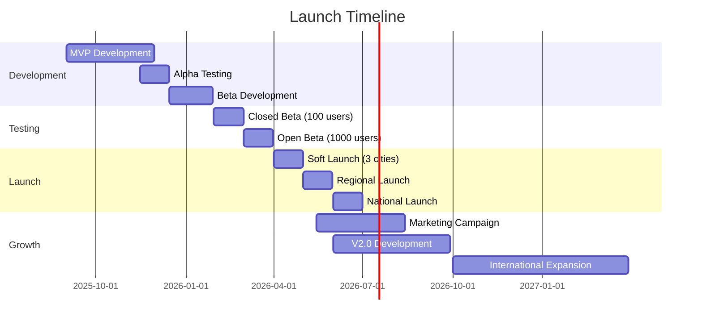

### 9.2 Go-to-Market Strategy

#### Phase 1: Soft Launch (Months 1-2)
- **Markets**: NYC, SF, Austin
- **Users**: 1,000 beta testers
- **Focus**: Bug fixes, UX refinement
- **Marketing**: Organic only

#### Phase 2: Regional Expansion (Months 3-4)
- **Markets**: Top 10 US cities
- **Users**: 10,000 target
- **Features**: Full MVP feature set
- **Marketing**: Local influencers, micro-targeting

#### Phase 3: National Scale (Months 5-6)
- **Markets**: 50+ US cities
- **Users**: 100,000 target
- **Features**: V1.1 with personalization
- **Marketing**: Paid acquisition, PR campaign

### 9.3 Marketing Channels

```yaml
organic_growth:
  - app_store_optimization (ASO)
  - search_engine_optimization (SEO)
  - social_media_presence
  - content_marketing
  - referral_program
  
paid_acquisition:
  - google_ads: $50_cpa_target
  - facebook_instagram: $40_cpa_target
  - tiktok_ads: $30_cpa_target
  - influencer_partnerships: $5k_per_campaign
  
partnerships:
  - event_venues
  - tourism_boards
  - local_businesses
  - ticket_platforms
  
pr_strategy:
  - tech_press_launch
  - local_media_coverage
  - startup_competitions
  - speaking_engagements
```

---

## 10. Business Model

### 10.1 Revenue Streams

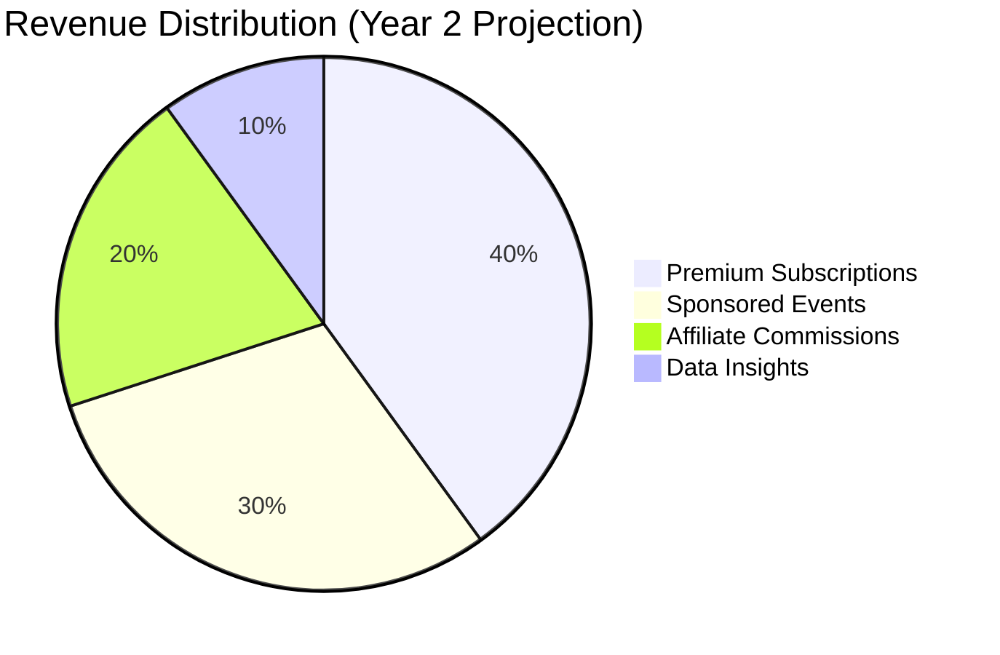

### 10.2 Monetization Strategy

#### Freemium Model
```yaml
free_tier:
  - basic_event_discovery
  - ai_chat (10_messages/day)
  - save_10_events
  - standard_filters
  
premium_tier: # $4.99/month
  - unlimited_ai_chat
  - unlimited_saves
  - advanced_filters
  - notification_alerts
  - no_ads
  - early_access_features
  
organizer_tier: # $29.99/month
  - event_posting
  - analytics_dashboard
  - promoted_placement
  - audience_insights
  - email_campaigns
```

### 10.3 Financial Projections

| Metric | Year 1 | Year 2 | Year 3 |
|--------|--------|--------|--------|
| MAU | 100K | 500K | 2M |
| Premium Conversion | 2% | 5% | 8% |
| ARPU | $0.50 | $2.00 | $4.00 |
| Monthly Revenue | $50K | $1M | $8M |
| Burn Rate | $200K | $500K | $1M |
| Runway | 18 mo | 24 mo | ∞ |

---

## 11. Risk Management

### 11.1 Risk Matrix

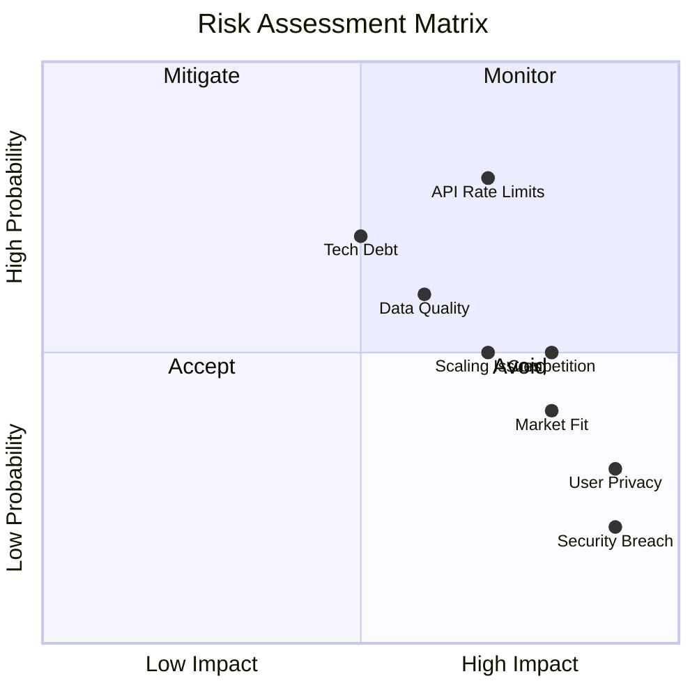

### 11.2 Mitigation Strategies

| Risk | Impact | Probability | Mitigation |
|------|--------|-------------|------------|
| API Quota Exceeded | High | High | Multi-tier caching, request batching, backup providers |
| Poor Event Coverage | High | Medium | Multiple data sources, user-generated content, partnerships |
| AI Hallucinations | Medium | Medium | Grounding in API data, confidence scores, fallbacks |
| User Churn | High | Medium | Personalization, push notifications, loyalty program |
| Competition | High | Medium | Unique AI features, fast iteration, community building |
| Privacy Concerns | High | Low | Transparent policies, opt-in features, data minimization |
| Technical Debt | Medium | High | 20% time for refactoring, automated testing, code reviews |
| Security Breach | High | Low | Security audits, penetration testing, bug bounty program |

---

## 12. Success Metrics & KPIs

### 12.1 OKR Framework

```yaml
objective_1: "Become the go-to app for local event discovery"
  key_results:
    - achieve_100k_mau_by_q4
    - maintain_4_star_app_rating
    - reach_25_percent_d7_retention
    
objective_2: "Build a world-class AI discovery experience"
  key_results:
    - 50_percent_users_engage_with_chat
    - 80_percent_ai_recommendation_relevance
    - sub_2_second_chat_response_time
    
objective_3: "Create sustainable unit economics"
  key_results:
    - reduce_cac_below_10_dollars
    - achieve_3_month_payback_period
    - reach_5_percent_premium_conversion
```

### 12.2 Dashboard Metrics

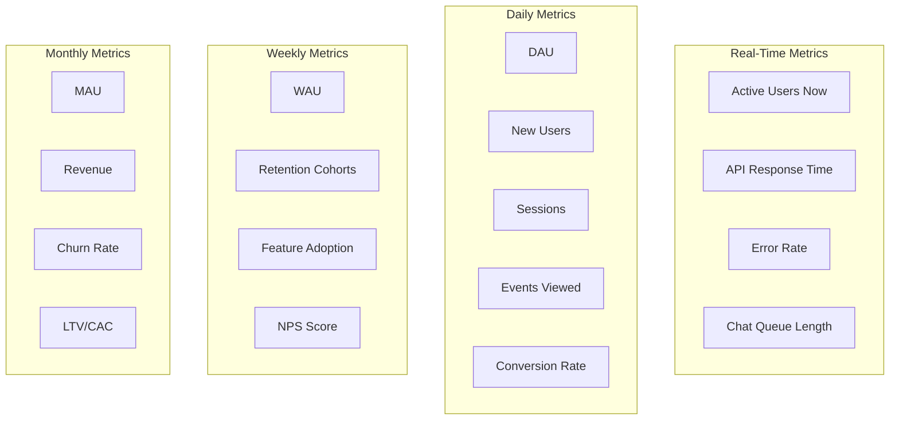

---

## 13. Team & Resources

### 13.1 Team Structure

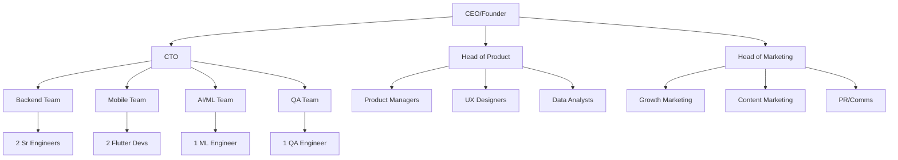

### 13.2 Resource Requirements

| Phase | Headcount | Burn Rate | Duration |
|-------|-----------|-----------|----------|
| MVP | 5 | $100K/mo | 3 months |
| Beta | 8 | $150K/mo | 3 months |
| Launch | 12 | $200K/mo | 6 months |
| Growth | 20 | $350K/mo | 12 months |
| Scale | 35+ | $600K/mo | Ongoing |

---

## 14. Appendices

### Appendix A: API Implementation Examples

```dart
// Flutter API Service Example
class EventApiService {
  final Dio _dio = Dio();
  final String _baseUrl = 'https://api.somethingtodoai.com/v1';
  final String _rapidApiKey = SecureStorage.get('RAPID_API_KEY');
  
  Future<List<Event>> searchEvents({
    required double lat,
    required double lon,
    double radius = 10.0,
    String? query,
    DateTime? dateFrom,
    DateTime? dateTo,
    List<String>? categories,
  }) async {
    try {
      // Check cache first
      final cacheKey = _buildCacheKey(lat, lon, radius, query);
      final cached = await CacheManager.get(cacheKey);
      if (cached != null) return cached;
      
      // Make API request
      final response = await _dio.get(
        '$_baseUrl/events/search',
        options: Options(headers: {
          'X-RapidAPI-Key': _rapidApiKey,
          'X-RapidAPI-Host': 'real-time-events-search.p.rapidapi.com',
        }),
        queryParameters: {
          'lat': lat,
          'lon': lon,
          'radius': radius,
          'query': query,
          'date_from': dateFrom?.toIso8601String(),
          'date_to': dateTo?.toIso8601String(),
          'categories': categories?.join(','),
        },
      );
      
      // Parse and cache
      final events = (response.data['events'] as List)
          .map((e) => Event.fromJson(e))
          .toList();
      
      await CacheManager.set(cacheKey, events, ttl: Duration(minutes: 5));
      
      return events;
    } catch (e) {
      Analytics.track('api_error', {'endpoint': 'search_events', 'error': e.toString()});
      throw ApiException('Failed to search events: $e');
    }
  }
}
```

### Appendix B: AI Integration Example

```python
# Gemini Integration Service
import google.generativeai as genai
from typing import Dict, List, Optional
from dataclasses import dataclass

@dataclass
class EventQuery:
    location: tuple[float, float]
    radius_km: float = 10
    date_range: Optional[tuple[str, str]] = None
    categories: List[str] = None
    price_max: Optional[float] = None
    keywords: List[str] = None

class GeminiEventAssistant:
    def __init__(self, api_key: str):
        genai.configure(api_key=api_key)
        self.model = genai.GenerativeModel('gemini-2.5-pro')
        self.conversation = None
        
    def parse_user_intent(self, 
                         message: str, 
                         context: Dict) -> EventQuery:
        prompt = f"""
        Parse this event discovery request into structured data:
        
        User message: "{message}"
        User location: {context.get('location')}
        Current time: {context.get('timestamp')}
        Previous queries: {context.get('history', [])}
        
        Extract:
        1. Time frame (tonight/tomorrow/this weekend/specific dates)
        2. Distance preference
        3. Event categories
        4. Price constraints
        5. Keywords or themes
        
        Return as JSON matching EventQuery schema.
        """
        
        response = self.model.generate_content(prompt)
        return self._parse_response(response.text)
    
    def generate_recommendations(self, 
                                events: List[Dict],
                                user_query: str) -> str:
        prompt = f"""
        You are an event concierge. The user asked: "{user_query}"
        
        Here are available events: {events}
        
        Provide a conversational response with 3-5 recommendations.
        Be specific about why each event matches their request.
        Keep it under 150 words.
        """
        
        response = self.model.generate_content(prompt)
        return response.text
```

### Appendix C: Database Schema

```sql
-- PostgreSQL Schema for SomethingToDoAI

-- Users table
CREATE TABLE users (
    id UUID PRIMARY KEY DEFAULT gen_random_uuid(),
    auth_id VARCHAR(255) UNIQUE NOT NULL,
    email VARCHAR(255) UNIQUE,
    username VARCHAR(50),
    created_at TIMESTAMPTZ DEFAULT NOW(),
    updated_at TIMESTAMPTZ DEFAULT NOW(),
    preferences JSONB DEFAULT '{}',
    location GEOGRAPHY(POINT, 4326),
    is_premium BOOLEAN DEFAULT FALSE,
    premium_expires_at TIMESTAMPTZ
);

-- Events table (cached from API)
CREATE TABLE events (
    id UUID PRIMARY KEY DEFAULT gen_random_uuid(),
    provider_id VARCHAR(255) UNIQUE NOT NULL,
    title VARCHAR(500) NOT NULL,
    description TEXT,
    start_time TIMESTAMPTZ NOT NULL,
    end_time TIMESTAMPTZ,
    venue_id UUID REFERENCES venues(id),
    organizer_id UUID REFERENCES organizers(id),
    categories TEXT[],
    tags TEXT[],
    price_min DECIMAL(10,2),
    price_max DECIMAL(10,2),
    currency VARCHAR(3) DEFAULT 'USD',
    ticket_url TEXT,
    image_url TEXT,
    is_virtual BOOLEAN DEFAULT FALSE,
    is_featured BOOLEAN DEFAULT FALSE,
    view_count INTEGER DEFAULT 0,
    created_at TIMESTAMPTZ DEFAULT NOW(),
    updated_at TIMESTAMPTZ DEFAULT NOW(),
    expires_at TIMESTAMPTZ,
    raw_data JSONB
);

-- Venues table
CREATE TABLE venues (
    id UUID PRIMARY KEY DEFAULT gen_random_uuid(),
    name VARCHAR(255) NOT NULL,
    address TEXT,
    location GEOGRAPHY(POINT, 4326),
    city VARCHAR(100),
    state VARCHAR(50),
    country VARCHAR(100),
    postal_code VARCHAR(20),
    place_id VARCHAR(255),
    amenities JSONB,
    created_at TIMESTAMPTZ DEFAULT NOW()
);

-- User favorites
CREATE TABLE favorites (
    user_id UUID REFERENCES users(id) ON DELETE CASCADE,
    event_id UUID REFERENCES events(id) ON DELETE CASCADE,
    created_at TIMESTAMPTZ DEFAULT NOW(),
    PRIMARY KEY (user_id, event_id)
);

-- Analytics events
CREATE TABLE analytics_events (
    id UUID PRIMARY KEY DEFAULT gen_random_uuid(),
    user_id UUID REFERENCES users(id),
    session_id VARCHAR(255),
    event_name VARCHAR(100) NOT NULL,
    properties JSONB,
    timestamp TIMESTAMPTZ DEFAULT NOW(),
    ip_address INET,
    user_agent TEXT
);

-- Chat sessions
CREATE TABLE chat_sessions (
    id UUID PRIMARY KEY DEFAULT gen_random_uuid(),
    user_id UUID REFERENCES users(id),
    started_at TIMESTAMPTZ DEFAULT NOW(),
    ended_at TIMESTAMPTZ,
    message_count INTEGER DEFAULT 0,
    context JSONB
);

-- Chat messages
CREATE TABLE chat_messages (
    id UUID PRIMARY KEY DEFAULT gen_random_uuid(),
    session_id UUID REFERENCES chat_sessions(id) ON DELETE CASCADE,
    role VARCHAR(20) NOT NULL CHECK (role IN ('user', 'assistant')),
    content TEXT NOT NULL,
    metadata JSONB,
    created_at TIMESTAMPTZ DEFAULT NOW()
);

-- Indexes for performance
CREATE INDEX idx_events_location ON events USING GIST (location);
CREATE INDEX idx_events_start_time ON events (start_time);
CREATE INDEX idx_events_categories ON events USING GIN (categories);
CREATE INDEX idx_events_tags ON events USING GIN (tags);
CREATE INDEX idx_analytics_events_user ON analytics_events (user_id, timestamp);
CREATE INDEX idx_analytics_events_name ON analytics_events (event_name, timestamp);
```

---

## Document Control

**Version History:**
- v1.0 - Initial PRD (Basic)
- v2.0 - Expanded PRD with full specifications

**Approval Chain:**
- Product Owner: _____________
- Engineering Lead: ___________
- Design Lead: _______________
- CEO/Founder: ______________

**Next Review Date:** [Date + 30 days]

---

*This PRD is a living document and will be updated as the product evolves through user feedback and market insights.*